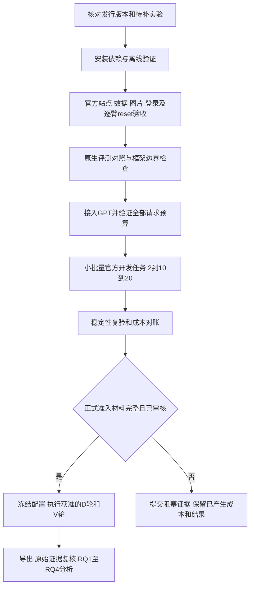

# PSS-WebTest 实验人员操作与交付手册

**适用人员：**提供 GPT API 资源、部署云主机、执行实验和整理证据的实验人员，以及负责验收的项目组成员。

**文档日期：**2026-09-22。**研究协议：**`pss-manuscript-v2.1`。

**代码基线：**`8796b8b` 加本次预算与调度分支整合（原分支终点 `95c537d`）；运行身份升级为 `diagnostic-task-bound-v3`。后续发行版应填写完整 commit，不能仅写“最新版”。

**本次目标：**用受控成本验证真实实验链路，再补齐获得授权且通过准入的 GPT 实验单元，交回可复核的原始证据和分析输入。

[项目首页](README.zh-CN.md) · [技术文档](docs/technical/README.md) · [当前证据状态](docs/STATUS.md) · [云主机详细安装](code/local-lab/cloud-handoff/README.md) · [原生开发验收协议](code/local-lab/ACCEPTANCE-RUNBOOK.md)

> **请先读：接入 API key 不等于可以直接启动正式实验。** 当前公开基线可以进行离线检查、输入准备、框架组件检查及受条件限制的诊断运行；共享预算已接入控制台和原生框架传输，但三套 benchmark 的完整环境/评测验收、全部计费路径核验和正式调度准入仍有待交付项。本手册把“现在可以执行的命令”“需要真实交付材料才能执行的命令”“尚未具备的一键入口”分开。不要为了让命令跑起来而修改 `confirmatory_authorized`、删除校验或把 `formal` 改成 `diagnostic`。

## 目录

1. [本次应该跑什么](#1-本次应该跑什么)
2. [版本、职责与开工交接清单](#2-版本职责与开工交接清单)
3. [主机、目录与依赖准备](#3-主机目录与依赖准备)
4. [接入 GPT API](#4-接入-gpt-api)
5. [1500 元预算、预警与单任务限制](#5-1500-元预算预警与单任务限制)
6. [先完成不付费的检查](#6-先完成不付费的检查)
7. [三个 benchmark 各自的部署与评测要求](#7-三个-benchmark-各自的部署与评测要求)
8. [准备官方任务并冻结开发验收队列](#8-准备官方任务并冻结开发验收队列)
9. [GPT 付费验收的分阶段执行](#9-gpt-付费验收的分阶段执行)
10. [调度、输入绑定与执行命令](#10-调度输入绑定与执行命令)
11. [正式实验的批次与执行顺序](#11-正式实验的批次与执行顺序)
12. [前端控制台与值守](#12-前端控制台与值守)
13. [失败分类、重试、暂停与恢复](#13-失败分类重试暂停与恢复)
14. [每次执行必须留下的输入和输出](#14-每次执行必须留下的输入和输出)
15. [结果核对、指标与分析流程](#15-结果核对指标与分析流程)
16. [模型路由和降本实验](#16-模型路由和降本实验)
17. [如何判断验收完成](#17-如何判断验收完成)
18. [交回材料、备份与排障](#18-交回材料备份与排障)
19. [一页值守清单](#19-一页值守清单)
20. [依据与维护](#20-依据与维护)

## 1. 本次应该跑什么

### 1.1 工作顺序



API 接入可在安装阶段准备；**实际付费调用排在环境、评测和预算检查之后**。不使用“先跑一大批看看能不能工作”的方式验收。

| 工作包 | 是否调用模型 | 用途 | 是否进入论文正式样本 |
|---|---|---|---|
| L0：源码/配置/离线测试 | 否 | 排除依赖、公式、输入和调度错误 | 否 |
| L1：站点、认证、状态恢复、跨实例隔离 | 通常不调用 actor；个别评测依赖需另列 | 确认测试环境可测量 | 否 |
| L2：框架注入响应与原生评测正负对照 | 框架注入响应不付费；原生 judge 可能计费 | 确认框架与评测接口，不测模型能力 | 否 |
| L3：真实 GPT 小规模官方任务 | 是，单请求/单任务/总额均设限 | 检查真实请求、观察、动作、输出、评测和账本闭环 | 否 |
| L4：开发队列与稳定性复验 | 是，按冻结队列分批 | 确认部署候选版本可稳定测量 | 否 |
| F：获准的正式 D/V 批次 | 是；脚本本身无运行时 LLM | 形成正式研究执行记录 | 仅满足全部准入和来源条件的记录 |
| R：单独注册的路由降本研究 | 视处理而定 | 比较成本和质量，不污染固定模型结果 | 独立实验，不能并入原固定模型单元 |

本次 API 额度首先保障 L0–L4 的工程验收。**1500 元不是整个正式研究的成本承诺。** 如果实测估价不能覆盖下一阶段，先交回成本和缺项报告；不得默默减少正式样本、轮数或保留失败更少的任务。

### 1.2 研究对象和任务数

| Benchmark | 官方源任务 | 当前研究计划任务 | 实验人员需要保留的含义 |
|---|---:|---:|---|
| WebArena-Verified，WAV | 812 | 600 | 官方 ID、模板、站点和原生任务评测；600 个具体 ID 须另行冻结 |
| VisualWebArena，VWA | 910 | 700 | 站点命名空间、图片、登录、最终页面和原生 evaluator；700 个 ID 须另行冻结 |
| ATA | 113 | 113 | 62 expected-PASS、51 expected-FAIL；不重平衡类别 |
| 合计 | 1835 | 1413 | 计划分母，不是本地已完成任务数 |

ATA 旧论文中的“112、56/56”已废止。任务数必须来自原始发布包的正确解析；不能补造记录或改标签凑数。WAV/VWA 的源任务准备工具会处理源集合，**不会自动替项目组证明 600/700 项的科学筛选已完成**。

### 1.3 GPT 对应哪些执行配置

以 [当前设计合同](code/config/study-design-contract.v2.1.json) 为准：

| 研究模型标签 | 配置 ID | 执行方式 | 适用分析 |
|---|---|---|---|
| m1：GPT-6 Astra | v1 | AgentLab/BrowserGym，截图型 | RQ1–RQ4 |
| m1：GPT-6 Astra | h1 | 同一模型，AgentLab/BrowserGym，受限结构辅助 | RQ1–RQ4 |
| m1：GPT-6 Astra | u1 | 同一模型，受限 Browser Use hybrid | RQ1 框架比较 |
| m2：GPT-5.6 Sol | v2、h2、u2 | 与上面三类配置对应 | 同上 |
| 共享基线 | s | 经审阅的人工 Playwright 脚本，无运行时模型 | RQ1–RQ4；所有模型比较共用 |

模型标签是研究设计中的名称，**不是本手册对 API 可用性的保证**。接入时必须由资源提供方确认准确 API ID、提供商、接口模式和可用特性。Codex/ChatGPT 应用中可选模型不自动等于本项目 API key 可以调用的模型。

本次工单必须明确：只补 m1，还是同时补 m1/m2；如只能获得另一个模型，项目组需登记新配置或修订设计，不能把它写成原模型。不能把 m1 的 v/h/u 分别指向不同模型来节约费用。

### 1.4 工作量：计划规模与待补规模分开

每个任务/配置有 D1、D2、V1–V10，共 12 次机会。假设相关 GPT 单元全部从零开始：

| 范围 | WAV | VWA | ATA | 合计 |
|---|---:|---:|---:|---:|
| 一个 GPT 模型的 v/h/u 三配置 | 21600 | 25200 | 4068 | 50868 |
| 两个 GPT 模型的六配置 | 43200 | 50400 | 8136 | 101736 |
| 单独共享脚本 s | 7200 | 8400 | 1356 | 16956 |
| 两个 GPT 模型加共享 s | 50400 | 58800 | 9492 | 118692 |

这张表不是立即下发的任务单。完整设计还包含其他四个模型，共 19 配置、322164 次计划机会。**接入 GPT 不意味着重跑其他所有模型，也不意味着从本地看不到记录就判定它们从未执行。**

项目组须先提供“已验证已有单元 / 明确待补单元 / 历史身份未知单元”清单。复用已有记录要求任务、来源、配置、轮次、环境、协议与证据一致；只有汇总成绩或同名模型不够。脚本 s 不因对比两个 GPT 而复制成两组独立观测。历史记录未核实时单列，不能与新批次直接合并。

RQ1–RQ4 通常分析同一套已核验 D/V 执行，不是四套各自再跑一遍的实验。RQ3 重点是 ATA 的错误条件分析；RQ4 是离线组合收益计算，不是在线切换模型重做网页任务。

## 2. 版本、职责与开工交接清单

### 2.1 本文对应的实现边界

| 项目 | 当前基线情况 | 开始相应付费批次之前必须具备 |
|---|---|---|
| GPT 传输 | 支持显式 OpenAI / 兼容服务配置；原生框架经 Python→Node bridge 调用 | 准确 API 身份、真实请求验证、价格与全路径预算接入 |
| 人民币共享总预算 | 已整合共享 guard、控制台和原生框架 Node bridge；缺价格即阻止 | 核验真实价格/账单、judge与辅助请求覆盖、云端并发验收 |
| 当前主线成本记录 | 原生请求有 campaign SQLite 预留 | 不得将单库 USD 预留误认为跨批次 CNY 1500 总限额或已核实账单 |
| WAV | shopping owned lifecycle 与特定官方任务探针 | 选定任务全部站点、认证、完整状态恢复和各配置验收 |
| VWA | 最终 live page 上的确定性原生评测路径 | 全站点依赖、reset；judge/VQA 任务的原生依赖接入与预算 |
| ATA | 发布标签/步骤参考比较器 | 原应用状态、reset 与参考标签一致性；比较器不是独立运行时真值机 |
| 正式调度 | 通用 worker/binder 目前拒绝正式 scope | 经过审核的正式准入和按待补清单执行的发行入口 |

特别注意：[WAV 官方 260/261/274 探针](code/local-lab/wav_official_acceptance_probe.py)当前基线写死 `aliyun/qwen3.8-max`；[WAV100](code/local-lab/WAV100-QWEN38MAX-PLAN.md)也是独立 Qwen 诊断计划。**二者不能通过更换 `.env` 密钥直接当作 GPT 实验入口。** 新基线还明确拒绝该探针的显式环境配置覆盖。已有[Qwen 官方 260/274 诊断证据](results/local-runtime/2026-09-22-wav100-acceptance.md)仅覆盖局部任务，不能替代 GPT 或完整 benchmark 验收。

### 2.2 角色分工

| 责任方 | 交付内容 |
|---|---|
| 项目组/集成人员 | 固定发行 commit、安装锁、任务 manifest、实际可执行的逐阶段 bindings、GPT 接入、预算统一、缺陷修复、验收报告 |
| API 资源负责人 | 项目级授权、准确模型/服务信息、价格凭据、预算/余额和速率限制、账单核对渠道 |
| 实验执行人员 | 按冻结版本安装、运行批准批次、监控和停止、保留全部失败/成本/证据，不自行修改科学口径 |
| 研究负责人/复核人员 | 筛选与人工准备规则、正式准入、缺失/失败复核、版本变化是否重验、最终数据接收 |

### 2.3 开工交付物

以下清单应填写实际文件与哈希，不接受只有文件名的空模板：

| 材料 | 至少包含 |
|---|---|
| release manifest | 完整 Git commit、分支/发行包 SHA-256、候选版本、改动清单、是否允许付费诊断/正式执行 |
| deployment profile | 实际 OS/架构、Docker context、专用容器、源代码路径、Python/浏览器/锁、磁盘余量 |
| task manifest | 官方身份、来源和输入哈希、WAV 模板/VWA 站点、附件、选择依据、已有/待补状态 |
| runtime bindings | 框架/模型/模式、完整配置哈希、命令与来源哈希、环境/基线、matched budgets、SDK 重试设置 |
| provider 配置 | 私有环境文件、授权 API ID、接口模式、允许的返回模型身份；密钥不进其他材料 |
| cost policy | 价格来源/核验日期、计费单位、输入输出上界、汇率/税费假设、共享账本和各级限额 |
| fixture/evaluator 包 | 全状态清单、reset/隔离证据、原生评测正负/畸形对照、认证与图片验证 |
| Traditional 准备包 | `run(session, public_task)` 脚本、源哈希、盲态准备记录、准备失败与耗时 |
| dispatch 工单 | 精确配置/任务/阶段白名单、分批上限、值守人、停止条件、输出位置 |

`study-runtime-bindings.v2.1.example.json` 的 `status=template-not-executable` 表示模板；填上模型名不意味着四个阶段的真实命令已经完成。

### 2.4 术语速查

| 术语 | 本手册含义 |
|---|---|
| actor / profile | 被测执行器 / 一类框架与观察方式，不能只按模型名识别 |
| fixture / baseline | 可重置的站点与数据 / 执行前应恢复的基准状态 |
| manifest / binding | 明确列出对象和身份的清单 / 将具体输入、配置、命令与哈希绑定的材料 |
| cohort / opportunity | 预定任务集合 / 一个任务×配置×轮次的计划执行机会 |
| lease / quarantine | worker有期限且受校验的执行权 / 不确定环境被隔离，不给下一任务复用 |
| HAR / trace / journal | 网络记录 / 浏览器回放 / 有顺序和哈希的动作及证据事件 |
| gate / admission | 未满足条件即阻止执行的检查 / 基于证据的准入决定 |
| null / unknown | 尚不可判定；不能当作0、失败或未发生 |

## 3. 主机、目录与依赖准备

### 3.1 主机要求

正式云端验收目标是独立 Linux x86_64 主机、Docker Engine/Compose v2 和本地块存储。先以单 worker、单独占环境验证。原生 x86 云机结果不能由 Mac/ARM 模拟结果替代。

VWA/ATA 原镜像、解压临时文件、Docker 层、数据库卷、模型缓存和轨迹可能同时占用磁盘。按[云部署手册](code/local-lab/cloud-handoff/README.md)测量 DockerRootDir 所在文件系统，记录安装/reset/执行峰值后确定容量，不在这里编造通用最低配置。远程 GPT 不消除本地站点或 VWA 评测模型的资源需求。

SQLite 放本地磁盘；多机并行需统一预算与调度服务，不能让每台机器各自拥有“1500 元总预算”。环境实例的隔离必须覆盖数据卷、缓存、搜索、文件/上传、队列和账号状态，不只是容器名不同。

### 3.2 建议目录

```text
/srv/pss/repo/                   固定发行源码
/srv/pss/envs/                   wav / vwa / agentlab / browser-use 独立环境
/srv/pss/assets/                 官方镜像、ZIP、SQL、ZIM、公开任务图片、模型权重
/srv/pss/private/                provider配置、认证状态、实际bindings、共享成本账本
/srv/pss/runs/<campaign-id>/     不覆盖的计划、收据、轨迹、评测、导出和交接记录
/srv/pss/backups/                一致性备份；不与运行中的数据库共用文件
```

管理员预先分配目录所有权。后续代码块使用 Bash；从指定目录执行。`/srv/pss/private/...` 是**需实际交付的文件位置约定**，不是仓库自带数据。所有输出后缀如 `001` 都应换为新的批次名；出现已存在文件时停止核对，不删除旧证据重跑。

### 3.3 获取并核验发行源码

```bash
# 新目录；release commit 必须来自实际交接单。
git clone https://github.com/WANGLEVY9/PSS-WebTest.git /srv/pss/repo
cd /srv/pss/repo
read -r -p '请输入交接单中的完整 release commit: ' PSS_RELEASE_COMMIT
git checkout --detach "$PSS_RELEASE_COMMIT"
git rev-parse HEAD
git status --short
```

核对源码 commit、发行哈希和工作区是否有未解释修改。本手册已进入主线；项目组应提供已发布且可获取的完整发行 commit 或带校验的 Git bundle，不让实验人员从几个工作区拼文件。

### 3.4 安装依赖

```bash
cd /srv/pss/repo/code
umask 077
npm ci
npx playwright install --with-deps chromium
mkdir -p artifacts/local-runtime
```

Node 至少 20，记录精确版本；Python 环境按用途分离：

| 环境 | 固定输入/约束 |
|---|---|
| WAV | 原源码要求 Python ≥3.11；Mac 本地锁不替代 Linux 锁 |
| VWA | 固定源码使用 Python 3.10/3.11；不能直接套用 Python 3.12 环境 |
| AgentLab/BrowserGym | 候选框架 0.4.2 / 0.14.2；审核独立目标平台锁及浏览器版本 |
| Browser Use + PSS actuator | 0.13.10；使用包含 actuator 依赖的完整候选声明，再解析审核 Linux 锁 |

Browser Use 当前本地完整候选为 `config/frameworks/h-browser-use-journaled-actuator.lock`。旧 `h-browser-use.lock` 少了 actuator 所需的 `greenlet/playwright/pyee`，不能拿它证明完整环境已锁定。候选锁里的平台包也不能不加审查直接用于 Linux。详见[完整依赖锁检查](code/local-lab/DEPENDENCY-LOCK-GATE.md)。

安装命令、系统包、来源 commit、镜像 ID、下载哈希、Python 分发包集合、浏览器 revision 和 `pip check` 输出都应留档。不要运行会重新解析/覆写冻结锁的旧 `frameworks:build` 辅助命令作为正式安装方式。逐包声明见[依赖库存](code/local-lab/cloud-handoff/dependency-manifest.json)；声明库存不是云端安装成功证明。

## 4. 接入 GPT API

### 4.1 接入前向资源负责人确认

- 服务为官方 OpenAI、获准的兼容服务，还是 Azure；当前 provider adapter **不支持 Azure 专用路由**。
- 准确模型 API ID，是否为固定版本或可漂移别名，图像输入和所需输出协议是否支持。
- `responses` 或 `chat-completions` 接口、推理强度可选值、输出 token 限制、图像计费和长上下文费用。
- API 项目与账单归属、额度/余额、RPM/TPM、是否允许多个 worker、资源有效期。
- 是否要求特定组织/项目 HTTP header：当前适配器不能假定已支持所有额外路由 header，有要求时先完成适配验收。

密钥通过约定的私有渠道交接；不写进 README、Git、截图、工单或命令行参数。参考 [OpenAI 生产实践](https://developers.openai.com/api/docs/guides/production-best-practices)。

### 4.2 建立独立私有环境文件

```bash
cd /srv/pss/repo/code
test ! -e /srv/pss/private/gpt-m1.env && \
  install -m 600 local-lab/openai.env.example /srv/pss/private/gpt-m1.env
# 用本机编辑器填写私有文件；不要通过聊天发送其完整内容。
```

该复制命令仅用于**尚不存在的首次文件**；已有配置先核对，不覆盖。文件示意如下，空值必须人工填写并核验：

```dotenv
PSS_LOCAL_PROVIDER=openai
OPENAI_API_KEY=
OPENAI_MODEL=
OPENAI_BASE_URL=https://api.openai.com/v1
OPENAI_API_MODE=responses
PSS_LOCAL_MAX_OUTPUT_TOKENS=1024
# 仅在目标模型和本次策略已确认支持时设置：
# PSS_OPENAI_REASONING_EFFORT=low
PSS_LOCAL_PORT=4173
PSS_LOCAL_ALLOW_DIAGNOSTIC_RUN=0
PSS_AUX_ENABLED=0
```

1024 是现有模板默认值，不是已验证适合所有 GPT 实验的上限。开发阶段应验证原生动作/终止输出不被截断，冻结实际值；不能在正式任务失败后临时加大输出预算。输出上限需考虑推理 token 的计费/限制规则，不能仅按可见 JSON 长度估计。

需要 m2 时建立另一份私有文件和明确配置身份。文件名或 API key 不区分实验，**冻结的 provider/model/configuration digest 才区分**。

兼容服务需 `PSS_LOCAL_PROVIDER=openai-compatible`、获准 HTTPS base URL 和准确的 `PSS_OPENAI_ALLOWED_ORIGIN`；不能把第三方地址填入 `openai` 模式，也不能以兼容服务结果冒充官方服务。base URL 不带 `/responses`、`/chat/completions`、凭证或查询参数。正式比较不允许请求失败后切服务/切模型重发。

### 4.3 只验证配置，不调用模型

安装 npm 依赖后，在 `code/` 执行：

```bash
PSS_LOCAL_ENV_FILE=/srv/pss/private/gpt-m1.env node --input-type=module <<'JS'
import {loadRuntimeEnv} from './local-lab/runtime-env.mjs';
import {resolveProvider} from './local-lab/provider.mjs';
try {
  const c = resolveProvider(loadRuntimeEnv());
  console.log(JSON.stringify({
    status: 'configuration-parsed-not-live-verified',
    provider: c.provider,
    model: c.model,
    api: c.api,
    max_output_tokens: c.max_output_tokens,
    reasoning_effort: c.reasoning_effort,
    model_requests: 0
  }, null, 2));
} catch {
  console.error('Configuration rejected; inspect private settings locally.');
  process.exitCode = 2;
}
JS
```

此命令不发送 key、不检查余额、不证明模型可用。不要把整个环境对象、key 或私有端点打印到公共报告。显式 `PSS_LOCAL_ENV_FILE` 使用隔离加载策略，配置开关要写入该文件，不能假定它继承旧 `.env` 或命令外部的同名前缀变量。

真实 API 验证应由已接通共享账本的调用路径完成，并同时验证：图片传输、原生框架动作解析、返回模型身份、usage、失败路径和最终计费。单独 `curl` 成功不能替代这些检查，也会绕过应用预算；本文不提供绕过账本的付费测试命令。

## 5. 1500 元预算、预警与单任务限制

### 5.1 本次建议沿用的开发预算政策

| 限制 | 值 | 行为要求 |
|---|---:|---|
| 开发验收共享总额 | CNY 1500 | 已结算费用 + 未知/在途预留均占用额度 |
| 提醒阈值 | CNY 1200，80% | 复核余量、下一阶段估价、账单延迟 |
| 严重告警 | CNY 1350，90% | 只完成已授权且有预留的工作；值守复核 |
| 停止接收新执行身份 | CNY 1425，95% | 不再开启新任务，保留在途结算空间 |
| 单执行单元费用 | CNY 15 | task × configuration × round，不是每次 HTTP 请求15元 |
| 单执行单元请求数 | 30 | 包括所有实际尝试和重试 |
| 单执行单元 actor 时间 | 240秒 | 开发默认，正式值另行冻结 |
| 动作数 | 30 | 老诊断链的24步可能更严格；不能混用默认值 |
| 共享 guard 单请求上限 | 45秒 | 原生 `LedgerModel` 当前默认30秒，且受剩余 actor 时间约束 |

这些值来自[共享预算工程规格](code/local-lab/SPEND-CONTROLS.md)。**共享 guard、控制台告警及原生框架 Node bridge 已整合**；Python 使用同一 opportunity ID 关联共享账本。真实价格表、平台账单、原生 judge 和所有辅助/直接 SDK 路径仍需验证；不能据离线通过宣称整个平台已完成费用闭环。

金额上限与性能分析不同：要记录预算中断，不得把它包装为模型能力失败或把这些任务从分母删除。正式实验的 matched budgets 由开发证据前置确定，不能依据正式题的难易度临时变化。

### 5.2 价格、预留与真实账单

价格必须绑定实际 provider/model/base URL、来源、核验/过期时间，以及输入、缓存输入、输出价格和可计费输入输出上界。图像、推理、服务等级、长上下文和税费不能遗漏；未知价格不能当0。默认价格表为空时应阻止付费派发。

8 CNY/USD 只是默认预算策略的保守规划参数，不是当天汇率。资源负责人应核验账单折算及费用口径。使用专用 API 项目，避免同 key 的其他程序消耗未进入本项目账本的费用。

`framework_model.py` 当前会预留每次请求，但结算调用保留未知成本；它并没有凭 token 自动生成已核实人民币账单。不能将“usage 存在”解释为“成本已闭环”。需要保留请求ID、usage、价格版本、预留与结算、资源方对账证据，并核对缺失覆盖。

1500 元是开发验收总额，不随 batch、进程重启、日期或新 SQLite 文件自动补充。360 次开发执行按每次15元计算的简单最坏界已超过1500元；单任务限额只是个体保护，不能据此保证全队列一定可负担。下一批最多可放行的额度应按**当前剩余总暴露空间和已核验请求上界**计算。平均成本只能用于预测，不能替代调用前原子预留。

### 5.3 两层限额与告警测试

资源负责人核实平台的实际硬限额与预警设置。官方说明区分“仅发送告警”和“阻止请求的硬限额”；执行和计费更新可能有延迟，因此平台限额与应用预留共同使用，不能保证一个设置精确到分地封顶。预算/余额错误不会因重复请求恢复。[OpenAI 额度与支出说明](https://help.openai.com/en/articles/6614457)

在**临时合成账本**完成以下演练，不用真实 key 故意花到阈值：

- 两个 worker 同时预留不会越过总额或单任务限额。
- 越过80/90/95%时出现可识别、持久的告警，重复刷新不消失。
- 暂停阻止新请求；在途请求可能继续计费，不能显示为已退款。
- 崩溃重启后未知预留仍占额度；更换 batch 不重置总额。
- 无价格、账本不可用、返回模型不匹配时停止派发。
- 浏览器断线后标记数据过期，重连后从服务端恢复真实状态。

当前共享预算设计的告警是本地告警，不自动发邮件/短信/webhook。需要远程通知时，应另外交付受控通知渠道并实测。首次付费阶段保持有人值守，不依赖尚未接通的通知。

## 6. 先完成不付费的检查

### 6.1 源码和便携验证

```bash
cd /srv/pss/repo
node scripts/check-docs.mjs
./scripts/check-public-boundary.sh
cd code
npm run study:validate
node local-lab/sponsor-portable-verify.mjs \
  --python python3 --output /srv/pss/runs/offline-001
```

`/srv/pss/runs` 的父目录需预先存在，`offline-001` 必须不存在。查看实际 `report.json`：检查源码哈希、通过/失败数、显式 not-run 和运行版本。源码执行期间发生变化时，本次报告不可作为冻结版本验收证据。

源码离线验证不要求模型 key；使用合成响应和本地浏览器。默认未运行的四组历史资产测试不能计为通过。需要资产测试时先获取真实固定资产，再用新输出目录加 `--with-artifacts`；旧资产检查不替代当前 v2.1 准入。

### 6.2 主机与依赖 doctor

复制并完整填写 [deployment profile](code/config/sponsor-deployment.example.json)，然后：

```bash
cd /srv/pss/repo/code
node local-lab/sponsor-portable-doctor.mjs \
  --profile /srv/pss/private/deployment.json --live-docker \
  --output /srv/pss/runs/doctor-001.json
```

这是只读调查，不会自动安装镜像或执行 reset。退出码2表示失败/未验证。空 `lock_file`、未量化容量、错误 image ID、额外未锁包都需处理，不能改报告状态绕过。

`expected_image_digest` 当前配置字段实际验证本地 Docker image ID；registry manifest digest 另行记录，二者不要互换。Docker 首页健康也不证明图片、登录、数据库、评测模型或跨实例状态隔离已就绪。

### 6.3 真实框架组件的无模型检查

下列路径应对应实际审核后的环境：

```bash
cd /srv/pss/repo/code
/srv/pss/envs/agentlab/bin/python local-lab/framework-native-probe.py --framework agentlab
/srv/pss/envs/browser-use/bin/python local-lab/framework-native-probe.py --framework browser-use
/srv/pss/envs/agentlab/bin/python local-lab/journaled-browser-probe.py \
  --output /srv/pss/runs/journal-probe-001
```

组件探针使用真实安装框架与注入响应；不是 GPT 能力结果。保存输出、包/浏览器版本和 source digest。脚本若因框架版本变化不能运行，应修复版本适配并重验，不把方法名改成另一个实现。

## 7. 三个 benchmark 各自的部署与评测要求

### 7.1 WAV

固定源 commit：`6473f72db5dcefc97b5725b59e734504edc28a21`。按所选任务的站点集合准备 shopping、shopping_admin、reddit、gitlab、wikipedia、map 依赖；购物站能跑不代表600项全部就绪。

每臂执行：官方公共输入 → 独占环境与reset → 必要登录/起始页面 → 实际框架动作 → 原始 `FinalAgentResponse` → 关闭上下文、封存完整HAR → 固定版本原生评测 → cleanup。

- 保留模板 ID，用于模板宏平均；多起始页不能只开第一页。
- 缺少 `require_login` 字段不能证明任务不需要认证。
- 原始答案不可先按 gold 修复；HAR 与答案必须来自同一次执行。
- 任务状态为 evaluator error 时记录 unavailable；不能自动当模型失败0分。
- 两张表/一个文件 marker 的reset证明不能代表所有数据库、缓存、队列、搜索和上传状态都已恢复。

详见 [WAV 技术设计](docs/technical/benchmarks/WAV.md)与[固定上游说明](https://github.com/ServiceNow/webarena-verified/blob/6473f72db5dcefc97b5725b59e734504edc28a21/README.md)。

### 7.2 VWA

固定源 commit：`89f5af29305c3d1e9f97ce4421462060a70c9a03`。按[云端部署手册](code/local-lab/cloud-handoff/README.md)准备 Classifieds、Shopping、Reddit、Wikipedia、Homepage 及选定任务的完整依赖。

- 原生环境变量、任务URL、cookie域、图片URL、服务端base URL需一致；宿主机与浏览器容器的127.0.0.1含义不同。
- 固定源码生成任务配置并生成/验证认证状态；部署修改使用独立工作副本并记录补丁，不污染只读源checkout。
- 原始任务图片应逐字节校验和按内容识别MIME；图片无法获取就记录阻塞，不能替换为文字摘要。
- GIF 的模型视图遵循当前原生首帧转PNG适配，原字节保留用于上传并记录双方哈希。
- **VWA 原生评测在 actor 结束后、页面关闭前，对同一个最终 live page 执行。** 不能关页面后重新打开一个相似页面来评分。
- 当前主线仅接确定性路径；fuzzy-text/VQA/captioning等模型评测需要原生依赖、版本、权重和独立计费/时间记录。未支持的任务保留在覆盖报告，不能删掉后宣称700项都已验收。

详见 [VWA 技术设计](docs/technical/benchmarks/VWA.md)、[部署步骤](code/local-lab/VWA-FIXTURE-DEPLOYMENT.md)及[原生 evaluator](https://github.com/web-arena-x/visualwebarena/blob/89f5af29305c3d1e9f97ce4421462060a70c9a03/evaluation_harness/evaluators.py)。

### 7.3 ATA

来源为 [Zenodo 发布包](https://zenodo.org/records/15198569)与固定 piñata 源码 `650b9edaa055915cb27d2498f379a66430cc3e02`。ZIP/六个CSV哈希以[源人口清单](code/config/ata-source-population.v1.json)和交付材料为准。

- 三类应用：Classifieds 30、OneStopShop 49、Postmill 34，共113案例。
- actor收到原始公共测试步骤和公共 `expectedResult`；隐藏PASS/FAIL、gold失败注释和其他臂结果不进prompt。
- 原论文的FAIL案例通过要求未实现功能构造；不意味着要准备51个被变异的应用镜像。[原论文4.2–4.3节](https://arxiv.org/html/2504.01495v1)
- 原始镜像、数据、账号和新鲜部署/reset仍需匹配。WAV优化Shopping不能未经核验直接代替ATA原应用。
- 保留重复显示步骤标签；执行序号与原文步骤标签不同，不能静默重编号。无法唯一对齐的步骤保持 `Ustep`。
- 终止输出为且仅为 `verdict` 和 `failure_step`；PASS/FAIL/null，只有FAIL允许正整数步骤。未判定是null，不是自动FAIL。
- 当前 `pss-ata-reference-evaluator-v1` 计算与发布参考的一致性，不是独立执行原应用后自动发现真值的oracle。真实fixture/标签一致性须由独立验收证明。

容量或镜像访问不足时，按[本地可行性记录](code/local-lab/ATA-LOCAL-DEPLOYMENT-STATUS-20260922.md)和云端清单转交缺项；不要调用未经授权的上游远程reset服务。

### 7.4 通用reset与隔离验收

每个 task × profile × repetition/round 都单独reset。先有状态基线，再执行可观察变更，确认变化，reset后确认恢复；同时检验另一个独立实例的内容未改变。云端操作要求记录至少三次复验；底层某个validator仅要求两次，不代表可以省略交付标准。

完整状态清单和双向隔离协议见[session与隔离交接](code/local-lab/SPONSOR-SESSION-AND-ISOLATION-HANDOFF.md)。不要直接复制含宽泛容器删除、硬编码端口和固定sleep的上游reset脚本到共享主机。任务超时/cleanup失败后先隔离环境，不立即归还下一任务。

## 8. 准备官方任务并冻结开发验收队列

### 8.1 获取源材料

精确克隆、图片/镜像下载及哈希检查按[云安装手册](code/local-lab/cloud-handoff/README.md)执行。保持官方源checkout干净。以下命令只准备输入；VWA准备阶段可能需要网络下载公开任务图片，**不会发出GPT请求**。下载失败会产生输入阻塞记录，应逐项核对。

```bash
cd /srv/pss/repo/code
python3 local-lab/prepare_navigation_runtime.py --benchmark wav \
  --source artifacts/benchmark-snapshots/webarena-verified \
  --output /srv/pss/runs/wav-inputs-001
python3 local-lab/prepare_navigation_runtime.py --benchmark vwa \
  --source artifacts/benchmark-snapshots/visualwebarena \
  --output /srv/pss/runs/vwa-inputs-001
python3 local-lab/prepare_official_runtime.py \
  --source artifacts/benchmark-snapshots/ata-zenodo/ISSTA_ARTEFACT/benchmark \
  --output /srv/pss/runs/ata-inputs-001
```

检查 `task-bindings.json`、阻塞列表、源任务与图片哈希。文件路径在换机器后可能变化，不能沿用另一机器的manifest哈希或绿灯。

### 8.2 冻结开发cohort

```bash
cd /srv/pss/repo/code
python3 local-lab/prepare_acceptance_cohort.py \
  --wav /srv/pss/runs/wav-inputs-001/task-bindings.json \
  --vwa /srv/pss/runs/vwa-inputs-001/task-bindings.json \
  --ata /srv/pss/runs/ata-inputs-001/task-bindings.json \
  --seed pss-dev-acceptance-v1 --campaign-id sponsor-gpt-m1-acceptance-001 \
  --output /srv/pss/runs/cohort-gpt-m1-001.json
```

该工具固定每benchmark20项，共60项；按源元数据分层和固定seed排序，不读取执行成绩。它不证明正式600/700项筛选完成，也不证明全部cohort已可运行。不可用任务留在cohort为blocked，不能事后换成易做任务。

A1/S1/S2 是开发验收标签，不能改名为 D1/D2/V1。`runtime_bindings_frozen=false`、`execution_authorized=false` 是当前准备工具的正常输出；不能只改两个布尔值就进入执行。

### 8.3 验收队列的数量

| 阶段 | 每benchmark累计不同任务数 | 四profile累计A1执行机会 | 相比上一阶段新增 |
|---|---:|---:|---:|
| 首批 | 2 | 24 | 24 |
| 扩展一 | 10 | 120 | 96 |
| 扩展二 | 20 | 240 | 120 |
| 稳定性 | 每benchmark预定5项，再各跑S1/S2 | 另加120 | 120 |
| 总计 | 60个不同任务 | 360 | 不是360个不同任务 |

一个模型候选的四profile为 AgentLab visual、AgentLab hybrid、Browser Use hybrid、Playwright。360项包含270项模型actor执行和90项脚本执行；原生judge费用另计。三阶段是嵌套扩展，不应把前2项和前10项全部再计一次。

当前验收schema固定四profile/每benchmark，不支持把两个GPT模型塞进同一个profile ID。m2应有独立模型候选与验收身份；是否能复用某些环境证据由版本/主机/绑定复核决定，不能为了省费复制m1的执行收据。正式分析共享s与开发验收如何复用证据是两个不同问题。

## 9. GPT 付费验收的分阶段执行

### 9.1 付费前检查

- 发行版本已包含全路径共享预算；真实价格、输入输出上界和账户限额已核验。
- 任务、图片、登录、site closure、reset与cleanup就绪；原生评测对照通过。
- 三种模型profile使用同一准确GPT身份；无SDK隐式重试、额外planner/judge/回退模型。
- 四profile的观察/动作/时间预算和环境参数已前置冻结。
- Traditional是明确标注来源、审阅过的脚本；开发AI脚本不得转成正式人工基线证据。
- 该批精确任务白名单、并发数、最高成本和输出目录已下发；有人值守。

缺任何必要项，记录BLOCKED及证据位置，停止该付费路径；其他无依赖的离线工作可以继续。

### 9.2 L3首批：先验证链路

对冻结cohort中每benchmark前2项依次执行四profile。首次单worker、串行独占fixture；不能在共用可变数据库上并行四臂。模型请求必须通过最终发行版的统一gate，禁止临时用上游默认 `Agent.run` 或直接API脚本代替。

每完成一个执行，值守人核对：

1. 任务/配置/环境/lease/输入哈希正确；reset和认证发生在本次执行之前。
2. GPT返回的动作经真实框架解析，纯视觉未获得DOM/URL/隐藏结构。
3. 截图/任务图片、动作、请求和actor-end原始证据完整。
4. 请求数、时间、token和费用/未知预留与账本一致。
5. WAV/VWA/ATA使用各自正确终止输出和评测位置。
6. cleanup成功且环境可安全重新reset；失败则隔离。

**模型答错允许保留为有效方法结果；工程链路坏了不允许继续扩大。** 不以“所有任务成功”作为放大条件，也不因模型失败而换题、改prompt、加暗示或重试到成功。

### 9.3 L4扩展与稳定性

首批证据复核及费用对账后，按冻结顺序扩至每benchmark10项、再20项，再对预定5项执行独立reset的S1/S2。每次放大前检查剩余额度、未知预留、失败聚类、磁盘和账单延迟。

实现修复会改变候选版本；保留旧失败和成本，在新证据目录按需要重新验收受影响范围。最终完整验收不得选择性拼接不同版本中最好的一次。不能为了得到360条“绿色”记录而隐藏曾经失败的尝试。

### 9.4 当前必须由项目组补齐的派发入口

目前没有经过三benchmark端到端验收的 `run-all-gpt` 一键命令。现成 `prepare_acceptance_cohort.py` 生成的是开发覆盖manifest；**没有已验收的通用转换器把它直接变成含 A1/S1/S2 的全部真实任务执行bindings和白名单派发计划**。

项目组在交付可付费发行版时，应同时提供：

| 交付项 | 实验人员核对内容 |
|---|---|
| GPT开发dispatcher或逐项已审核bindings | 参数/帮助、真实task/profile/repetition映射、白名单限制、每次派发数量、预算检查 |
| benchmark-specific reset/actor/evaluate/cleanup | 可执行文件、源哈希、环境和baseline、private setup/evaluator引用 |
| cohort→运行身份→coverage receipt映射 | 不混入D/V标签；不遗漏/重复；输出能被coverage audit真实接收 |
| 失败与成本导出器 | 原始状态保留、全部attempt计入成本、未知用量显式报告 |
| 正式准入实现 | 验收通过后再冻结；诊断worker不能直接充当正式执行入口 |

此处不是让实验人员自行开发这些缺口。没有交付时按工单反馈具体缺项，避免消耗赞助商资源试错。

## 10. 调度、输入绑定与执行命令

### 10.1 三类manifest不可互换

| 文件类别 | 生成/消费入口 | 关键区别 |
|---|---|---|
| 开发cohort | `prepare_acceptance_cohort.py` → `acceptance_coverage.py` | 60任务、四profile、A1/S1/S2；不是D/V调度计划 |
| 研究计划bundle | `study-workflow.mjs plan` | 当前固定19配置×12轮；生成plan和schedule-freeze |
| 低层执行binding | `bind_runtime_plan.py`、`runtime_worker.py` | 必须有真实命令、配置/来源哈希、公共输入/私有setup/evaluation分离 |

当前planner没有 `--models gpt`、`--round A1`、`--limit 24` 等参数；不要照着概念自行添加命令。当前binder要求完整19×12的冻结计划，且只接受diagnostic/synthetic。正式待补GPT白名单派发是必须另行交付并验收的功能，不能靠截断JSONL伪造“通过了freeze校验”。

当前执行身份同时绑定 schedule、完整 task manifest、executor binding、task key、configuration 和 round。任务清单新增 `evaluation_sha256`、`evaluation_ref_sha256`；有 setup 时还冻结 `setup_ref_sha256`。在生成计划前填入 `executor_binding_sha256_by_benchmark`。旧身份不得改名复用或直接重新入队。

### 10.2 只生成研究计划，不执行

项目组已提供合法 `protocol_id/scope/tasks/bindings` bundle 后，可从 `code/` 使用：

```bash
node local-lab/study-workflow.mjs plan \
  /srv/pss/private/study-bundle.json /srv/pss/runs/study-plan-001
```

输入若是完整 `formal` 研究manifest，工具验证600/700/113分母并生成322164机会；仍输出 `new_execution_authorized=false`。该命令不调用GPT、不导入成绩、不reset、不派发。

输出包含 `source-bundle.json`、`opportunities.jsonl`、`schedule-freeze.json`、`report.json`。保持原始字节，不能格式化JSONL后继续沿用旧哈希。空/不完整runtime binding出现 `runtime_ready=false` 是缺项信号。

### 10.3 已审核诊断计划的绑定和单次执行

下列是**低层诊断接口说明**，不是完整开发cohort或正式研究的启动脚本。只有集成人员已提供满足schema的私有文件并验证前置条件后，实验人员才运行：

```bash
cd /srv/pss/repo/code
python3 local-lab/bind_runtime_plan.py \
  --plan /srv/pss/runs/diagnostic-plan-001/opportunities.jsonl \
  --freeze /srv/pss/runs/diagnostic-plan-001/schedule-freeze.json \
  --bindings /srv/pss/private/diagnostic-executors.json \
  --output /srv/pss/runs/diagnostic-bound-001.jsonl

python3 local-lab/runtime_worker.py enqueue \
  --database /srv/pss/private/diagnostic-campaign-001.sqlite \
  --input /srv/pss/runs/diagnostic-bound-001.jsonl

python3 local-lab/runtime_worker.py status \
  --database /srv/pss/private/diagnostic-campaign-001.sqlite

# 会产生实际外部动作/可能计费；每次只尝试领取一个匹配单元。
PSS_LOCAL_ENV_FILE=/srv/pss/private/gpt-m1.env \
  python3 local-lab/runtime_worker.py work \
  --database /srv/pss/private/diagnostic-campaign-001.sqlite \
  --input /srv/pss/private/approved-one-executor.json
```

`diagnostic-executors.json` 包含冻结计划哈希、各任务输入引用和executor集合；`approved-one-executor.json`是其中一个实际binding，不是provider `.env`，也不是 `study-runtime-bindings.v2.1.example.json`。`work`按配置/环境领取队列任务，**没有本手册可调用的task ID白名单参数**；首批任务约束必须在经审核的dispatcher/队列构建中实现，不能仅凭操作员心里记得“只跑2条”。

重复 `enqueue` 的幂等语义不等于已经发生的网页操作可以重放。`status`会打开/初始化SQLite，查询前核对真实存在的数据库路径；输错新路径会得到空状态，不能据此认为旧任务丢失或预算归零。

不要编写无限 `while` 循环批量调用 `work`。后续自动派发要验证预算、阶段、任务白名单、失败阈值和停止行为后再交付。

### 10.4 框架身份与观察边界

- AgentLab visual/hybrid使用真实GenericAgent决策组件，但PSS控制生命周期、观察投影和执行器。
- Browser Use使用受限决策/schema组件，默认`Agent.run`、默认工具、judge和fallback不属于当前处理；新基线在导入前关闭并核验第三方telemetry/cloud sync。
- 按键工具使用大小写敏感的允许枚举；typing表示插入文本，不自动清空旧文本。动作/截图超时及有限观察重采集策略都需冻结，不能把重采集时间排除在actor预算之外。
- visual只使用允许的截图/公共任务/自身动作状态；不能引入OCR、DOM、AX、URL或评测反馈作为决策输入。
- hybrid只增加当前真实可见控件投影，不能直接给完整DOM/AX树。
- Traditional只运行经盲态准备、审阅和hash绑定的脚本；不允许运行时LLM修复脚本。

详见 [测试范式](docs/technical/TESTING_PARADIGMS.md)、[输入输出合同](docs/technical/INPUT_OUTPUT.md)和[框架对照](docs/technical/UPSTREAM_TRACEABILITY.md)。这是一套受控适配实验，不是重跑每个上游默认agent排行榜。

## 11. 正式实验的批次与执行顺序

本节定义**未来通过准入后应执行的科学流程**；当前基线不提供可直接启动此阶段的正式命令。

### 11.1 冻结

冻结任务ID与顺序、source/input/setup/evaluation哈希、模型provider/API/返回身份规则、框架/浏览器版本、prompt/action/image/reasoning参数、viewport/locale/timezone、matched budgets、reset基线、人工脚本及准备记录、分析版本和成本政策。必须留有主机与候选版本的验收引用。

已曝光开发任务的历史应记录；不能事后宣称完全未见。开发队列不自动成为正式任务集合。任务筛选、可准备性和失败记录的处理必须符合研究合同。

### 11.2 D1、D2

按已审核任务与配置的冻结调度执行发现轮，记录失败/未准备/未解决。现有调度有D阶段在V阶段前的门禁；GPT-only正式增量执行需要正确处理其他配置已有/未知D轮状态，不能把缺少的非GPT结果伪造为terminal以解锁。

ATA的发现错误与同参考类别正确对照由已冻结代码计算。实验人员不要依据D轮错误给接下来的模型加提示、修改脚本或改变任务状态。

### 11.3 V1–V10

用同一冻结处理进行新的独立reset执行，不从D轮或其他方法的浏览器状态续跑。每轮保留全部计划机会和缺失原因。研究分析使用V1–V5、V6–V10两个窗口；不要只跑到模型成功就停，也不要把工程重试计作新V轮。

任务×轮内的方法顺序来自冻结调度；不要为便利把一种方法永远放在最早/最后而不声明。模型别名、服务端版本或站点状态变更需记录，并由负责人决定是否分层或重新冻结；不得静默拼接。

### 11.4 增量补跑

增量派发依据经审核的待补单元清单，保留原opportunity身份和完整分母。已经产生不确定外部副作用的单元先复核，不直接再发一次。原先有结果的单元如需技术复验，使用新attempt/候选身份留存，不覆盖首条记录，也不择优替换。

已经存在且合规的共享s记录在分析中复用；没有脚本或盲态准备证明的任务保留unprepared/unknown状态，不能为凑齐数据让GPT现写脚本。

## 12. 前端控制台与值守

### 12.1 启动和访问

```bash
cd /srv/pss/repo/code
PSS_LOCAL_ENV_FILE=/srv/pss/private/gpt-m1.env node local-lab/server.mjs
```

在自己的电脑建立SSH转发：

```bash
ssh -N -L 4173:127.0.0.1:4173 EXPERIMENT_USER@CLOUD_HOST
```

浏览器访问本机 `http://127.0.0.1:4173/`。服务保持loopback；不要直接对公网开放控制台。避免与同端口旧dashboard同时启动。

### 12.2 当前界面能证明什么

旧主界面主要展示WAV检索诊断，并不会因切换显示名称自动变成原生AgentLab/Browser Use三benchmark调度器。当前`Collection paused`可能是正确的gate状态。新增正式收据/开发coverage以哈希绑定的acceptance pointer发布，界面只读显示不等于派发已开放。

共享人民币预算面板、暂停和告警已整合，并与开发 coverage 面板同时保留。它显示接入同一 guard 的费用，不代表其他进程或平台全部开销。发行版需逐项核验：

| 界面项 | 显示要求 |
|---|---|
| 身份 | campaign、host、release、配置ID、请求/返回模型、范围diagnostic/formal |
| 进度 | planned / prepared / started / scorable / lifecycle-completed / successful分别显示 |
| 成本 | 已结算、未知/在途预留、可用余额、总额和单任务限额、价格版本 |
| 告警 | 80/90/95%与硬阻止、时间、原因、影响任务；持久记录 |
| 任务状态 | 失败阶段、actor终止、native结果、预算、cleanup分开，不只一个红绿灯 |
| 连接状态 | 刷新时间、断线/过期标记，不把旧数字显示为实时余额 |
| 证据 | 可追溯到受权限控制的原记录；不公开key、cookie、gold和私有路径 |

控制台暂停只阻止其已接入gate的未来派发/预留；不等于取消所有已发请求，也不等于能停止另一个独立CLI进程。Ctrl-C关闭server也不保证已启动worker全部结束。值守须同时核对进程、租约和账本。

## 13. 失败分类、重试、暂停与恢复

### 13.1 先保留证据，再决定是否继续

| 现象 | 归类/判断 | 操作 |
|---|---|---|
| API 401/403、权限/模型不存在 | 资源/配置问题 | 停止该provider后续派发，核验授权，不换模型冒充原配置 |
| 429且明确限额/余额耗尽 | 预算/配额问题 | 停止，核验平台账单；不自动升额、不反复重试 |
| 明确瞬时速率限制/服务错误 | 可审查的传输失败 | 仅按已冻结单一retry-owner策略处理；记录每次尝试和成本 |
| 网络断开/请求超时、是否送达不明 | 不确定副作用/计费 | 保留预留并暂停复核；不盲目重放 |
| 图片/认证/站点缺失 | 环境或输入不可用 | 阻止该任务路径，保留计划分母与具体缺项 |
| actor超时/动作预算耗尽 | 资源中断 | 保留终止原因；之后原生成功也不能改成合规完成 |
| 原生评测有效且score=0 / ATA判断错误 | 可能是有效方法失败 | 保留；不换题或改gold；复核是否确有环境问题 |
| evaluator异常/不支持的judge | 评测不可用 | native结果null，不当0或成功 |
| cleanup/reset/lease失败 | 环境隔离/不确定性 | quarantine，确认旧worker停止后调查 |
| JSON/动作格式错误 | 协议失败 | 保留原输出；不借gold修复、不由便宜模型代答 |
| 磁盘满/OOM/证据不完整 | 工程/资源故障 | 停止新任务，保全已写数据，扩容/修复后重新验收 |

429必须根据原始响应的具体error code判断，不能只看HTTP状态。官方平台区分速率限制与额度/余额错误。[API错误文档](https://developers.openai.com/api/docs/guides/error-codes)

### 13.2 重试的四种含义

1. **HTTP重试：**一次已计入请求/成本的再调用。当前原生`LedgerModel`单attempt；不要套一个外层自动重试放大费用。
2. **框架解析重试：**可能再次请求模型；每次都要计费和计时，不能藏在SDK里。AgentLab当前设置只允许一次解析尝试。
3. **工程复验：**修复后的新证据执行，不覆盖失败，候选版本变化需重新绑定。
4. **研究重复轮：**预先规定D/V机会，不由上一次成功失败决定是否发生。

代码中存在`reliable-provider.mjs`的有限重试实现，不意味着每条框架路径都使用它。验收以实际bridge和源码/请求记录为准，不能在不同层同时启用重试。

### 13.3 崩溃恢复

先停止新派发并确认哪些请求/浏览器/子进程仍在运行，保留数据库与WAL。对**已核对存在的原数据库**执行：

```bash
cd /srv/pss/repo/code
python3 local-lab/runtime_worker.py status \
  --database /srv/pss/private/diagnostic-campaign-001.sqlite
python3 local-lab/runtime_worker.py recover \
  --database /srv/pss/private/diagnostic-campaign-001.sqlite
python3 local-lab/runtime_worker.py status \
  --database /srv/pss/private/diagnostic-campaign-001.sqlite
```

`recover`会修改过期租约状态；只在核实目标库及现场后运行。未开始的过期lease可回队列；已started的机会进入uncertain并继续占环境锁。它不是“把所有失败重新排队”。后续不确定性解除需要旧worker确已终止、环境/账单复核和证据哈希；不要手改SQLite删除锁或将费用置零。

使用暂停/停止时记录UTC时间、原因、操作者、受影响机会、在途请求、保留额度与恢复依据。恢复后沿用共享预算；不重新创建空总账本。

## 14. 每次执行必须留下的输入和输出

### 14.1 输入分区

| 分区 | 消费者 | 不能泄漏给actor的内容 |
|---|---|---|
| 调度manifest | 调度/审计/分析 | 其他臂结果、隐藏ATA类别等参考信息 |
| 公共actor输入 | 被测执行器 | 仅原始公共intent、图片和ATA公共步骤；不加入gold |
| 私有setup | 可信session wrapper | reset/路由/认证文件、私有起始状态 |
| 私有evaluation | 原生/参考评测 | 原始答案、标签、断言配置和隐藏证据 |

提交一次执行前要绑定task key、official ID、source/input/setup/evaluation哈希、config/round、opportunity/environment、候选版本和实际租约。当前worker采用v3收据，仍保留原生生命周期计时；历史v2记录保持原样，必须显式核对，不能改字段冒充新版本。

### 14.2 输出清单

| 证据 | 最小内容 |
|---|---|
| reset与authentication | 本次执行身份、基线、状态恢复、登录和隔离证据引用 |
| 观察与动作journal | 连续事件序号、前项哈希、截图字节哈希、动作尝试/接受结果、tab和资产身份 |
| API尝试 | 请求ID、准确模型/设置、开始结束、usage/缺失、预留/结算、超时/失败 |
| actor-end | 原始终止输出、终止原因、预算与动作数、实际actor时间，不得事后改写 |
| lifecycle seal | 原始actor receipt引用、封存HAR/trace、阶段时间及源码/输入身份 |
| benchmark assessment | 原生输入/输出引用、有效性、score或verdict/step分类、评测版本 |
| cleanup | 完成或失败、环境是否隔离/可复用 |
| reviewer disposition | 方法/工程/外部/预算/未知归因、证据、复核人，不由模型自动判因 |

`lifecycle_completed`、`protocol_completed`、`assessment_status`、`native_score`、`operational_correctness`是不同概念。网页看上去成功、模型说“done”、生命周期结束或某个oracle分数1，都不能替代其他字段。

截图、HAR、trace、原始模型输出、prompt、参考答案、认证和数据库保留在私有证据区。公开材料只发布经审阅的计数、哈希、版本和去敏摘要。不要把包含cookie/个人数据的完整HAR直接上传到GitHub Issue。

## 15. 结果核对、指标与分析流程

### 15.1 每批先核对数量与身份

核对固定任务集合、配置和轮次；不允许重复task/config/round，不接受无来源的补行。分别报告：计划数、prepared、started、native可评分、lifecycle完整、protocol完成、native成功、未准备、未解决、预算中断。不能只输出“成功率”。

每benchmark/模型/profile单独报告；不能把WAV、VWA任务成功与ATA verdict accuracy混成一个总体分数。缺usage和未知成本单列覆盖率，不设0。

### 15.2 原生与研究指标

| 分析 | 记录/分母要点 | 常见错误 |
|---|---|---|
| RQ1 WAV | 每轮模板内任务成功，再模板宏平均，再轮次等权；同时报可评分覆盖 | 用全部执行简单微平均替代模板宏平均 |
| RQ1 VWA | 原生任务成功与评测可用性；分轮和轮次汇总 | 跳过不支持judge的任务后当作全体成绩 |
| RQ1 ATA | FAIL为阳性；TP/FN/TN/FP、binary coverage、accuracy/sensitivity/specificity；AFB/AFC/AFA/Ustep | 把PASS当阳性；把无verdict自动改FAIL；把正确verdict当正确步骤 |
| RQ2 | 固定1413任务中相应benchmark的task×12轮；未准备与明确失败0，未解决保留null与界 | 删除准备失败、只看完成任务、缺失当0费用 |
| RQ3 | ATA D1/D2错误cohort与同参考类别正确controls；V轮alternative minus visual correctness及excess gain | 颠倒符号、V轮挑样本、当作因果效应 |
| RQ4 | V1–V5/V6–V10，共同可用门槛8，首个可用结果，共用四结果块 | 四次取并集、给混合方法更多尝试、当在线router效果 |
| 效率 | 准备劳动、actor、setup、评测、finalization及全部API attempts/费用分别报告 | 用脚本执行时间代替人工编写时间；隐藏VWA judge费用 |

ATA二元指标的分母需连同coverage报告：accuracy=(TP+TN)/binary-assessed，sensitivity=TP/(TP+FN)，specificity=TN/(TN+FP)；分母0时不可报成0%或100%。精确字段与缺失处理以[分析输入文档](code/local-lab/ANALYSIS-AND-ROUTING.md)和[研究指标指南](docs/RESEARCH.md)为准。

### 15.3 审计与导入命令

有真实轨迹后，先作只读完整性审计：

```bash
cd /srv/pss/repo/code
python3 local-lab/replay_audit.py /srv/pss/runs/ACTUAL_EXECUTION_DIRECTORY
```

路径必须指向包含真实 `trajectory.jsonl` 的执行目录；审计通过只证明链/文件一致，不证明评分真值或科学公平性。

开发验收包由真实收据组成后：

```bash
python3 local-lab/benchmark_acceptance.py \
  --package /srv/pss/private/fixture-acceptance-package.json \
  --output /srv/pss/runs/fixture-audit-001.json
python3 local-lab/acceptance_coverage.py \
  --package /srv/pss/private/development-coverage-package.json \
  --output /srv/pss/runs/coverage-audit-001.json
```

退出码2意味着证据未满足要求。只有12个fixture cell通过不能替代360条任务级证据。coverage包的schema及artifact字段见[验收runbook](code/local-lab/ACCEPTANCE-RUNBOOK.md)；不能从本README模板生成“measured”收据。

研究规范化bundle经过来源复核后：

```bash
node local-lab/study-workflow.mjs import \
  /srv/pss/private/normalized-study-bundle.json /srv/pss/runs/study-import-001
```

导入产生coverage/analysis/observability（有实际records时）和report，保留原bundle；不会派发缺失任务。该接口依赖项目组完成原始worker收据→规范化records的可信转换，**不是将SQLite文件或任意snapshot直接作为JSON输入**。

若已准备合法 `pss-analysis-input-v1`：

```bash
node local-lab/analyze-study.mjs \
  /srv/pss/private/analysis-input.json /srv/pss/runs/analysis-001.json
```

A1/S1/S2开发数据不得伪装成D/V导入正式分析。`data_kind`和`scope`都是来源描述，不自动赋予准入资格；analysis模块版本字符串仍可能为 `manuscript-rq-analysis-v2.0.0`，不代表active study退回v2.0。不要从论文的四舍五入表格恢复逐任务数据。

## 16. 模型路由和降本实验

先完成固定模型测量链路，之后才做独立成本实验。以下策略需要区分：

| 环节 | 默认处理 |
|---|---|
| reset、schema、调度、哈希、指标汇总 | 确定性程序，无需LLM |
| 网页行动决策、被测输出 | 固定被测GPT，不能静默降级 |
| VWA原生模型评测 | 按原生语义冻结模型/权重/设置，单独记录成本；不能随意换成便宜judge |
| 完成批次后的故障元数据归类 | 可考虑独立便宜模型，默认关闭，只作待复核注释 |
| 根据置信度/任务难度切换便宜与昂贵actor | 新的研究处理，单独配置、冻结规则和验收 |

若开展路由实验，应先登记固定模型基线、路由策略、可使用的信息、升级/停止规则、任务选择、同等预算口径、成功与未解决覆盖、总费用和延迟。包括路由判定自身调用的成本。禁止使用隐藏gold或未来结果决定何时切模型。

后置辅助模型只能接收约定的脱敏元数据，不能返回动作、修改参考标签或替代官方评测。其输出不计作原模型能力，费用进入同一总预算但与actor费用分列。现有`PSS_AUX_ENABLED=0`在主要验收中保持关闭。

## 17. 如何判断验收完成

### 17.1 工程验收

以下全部具备，才可以建议进入正式准入审查：

- 精确候选版本在赞助商主机完成干净安装与离线检查；依赖/浏览器/镜像全锁定。
- 三benchmark完整任务依赖与12个benchmark/profile fixture cell证据通过；reset/认证/跨实例完整状态隔离可复核。
- 一个模型候选的360个规定开发机会有符合合同的任务级证据，缺项明确；原生方法失败保留，不要求高成功率。
- 真实GPT调用和原生输出协议走通，观察边界、请求身份、账本和provider对账通过。
- 严重系统性错误已处理；崩溃/超时/cleanup/未知计费恢复演练通过。
- 输出完整可审计，开发数据与正式数据分开，未用合成或其他主机的收据替代。

如果1500元预算只能完成其中一部分，应报告已验收范围与剩余成本/依赖，不写“全部通过”。若用户授权只验收WAV，则可以交付WAV局部结论，但不能把它当成三benchmark准入。

### 17.2 正式准入和正式交付

工程验收是必要条件，不是自动打开formal gate的按钮。研究负责人还需核验正式选择、blinded human preparation、历史记录可复用性、最终预算、实际模型绑定、派发白名单和分析版本。

正式数据完成度按约定待补单元与完整分母核对；“进程正常退出”“有一个CSV”“任务全是绿色”不是交付标准。存在unknown时保留，不以重跑到成功代替说明。

## 18. 交回材料备份与排障

### 18.1 私有交付目录建议

```text
handoff/<campaign-id>/
  README-summary.md             范围、版本、结果计数、成本和未完成项
  release/                      commit、源哈希、部署配置去密副本
  dependencies/                 Linux锁、镜像/浏览器/权重、安装日志与哈希
  manifests/                    任务、输入、配置、schedule、cohort、阶段白名单
  acceptance/                   doctor、reset/isolation、evaluator controls、coverage
  executions/                   原始收据、轨迹、截图、HAR、trace及请求证据
  accounting/                   一致性账本备份、价格版本、usage、账单核对摘要
  analysis/                     规范化输入、coverage/analysis/observability和复核记录
  incidents/                    失败、暂停、修复、重验与恢复决定
  checksums.sha256              交付文件校验清单
```

这是交付组织建议，不是所有程序自动输出的固定目录结构。原始文件保持不变并保存路径映射；如果JSON证据引用包含绝对路径，迁移到另一主机需要保留原位置映射或受审计的重新绑定，不能复制目录后宣称旧路径引用自然有效。

填写[云验收交回模板](code/local-lab/cloud-handoff/acceptance-receipt.example.json)。另附如下摘要：

```text
campaign_id / release_commit / host_id / 候选版本：
授权范围：离线 / GPT开发验收 / 正式待补 / 独立路由
实际provider、请求model、返回model与接口模式：
任务选择和配置哈希：
各benchmark/profile：planned / prepared / started / scorable / lifecycle完整 / native成功
未准备、未解决、预算中断、工程失败及其证据：
模型请求次数；usage覆盖；已结算人民币；未知预留；平台账单差异：
阶段起止UTC时间；actor/setup/evaluation/finalization统计：
磁盘与内存峰值；剩余容量；暂停/恢复记录：
复核人员、日期、结论和下一步缺项：
```

### 18.2 备份与传输

保持原文件的访问控制；收据/日志0600，目录0700，按批准渠道传输。SQLite使用一致性backup或停写后保存数据库与WAL；不要只复制运行中的主数据库文件。备份前后记录哈希与时间，确认没有在备份期间遗失in-flight状态。

公开包不包含key、cookie、reset token、原始prompt/HAR、私有账单标识和gold。准备公开摘要与私有完整包两个层级，不能把“删掉.env”当作完整去敏。第三方图片、镜像、数据的分发还需遵守原许可。

### 18.3 常见阻塞

| 问题 | 优先检查 | 交回内容 |
|---|---|---|
| 模型配置解析通过但真实请求失败 | 准确API ID、权限、接口/参数/图片/schema支持、余额 | 去敏错误码、请求ID、配置哈希，不发key |
| GPT设置无效，仍跑Qwen | 是否调用写死Qwen的task-260/WAV100入口；显式env是否生效 | 入口源码/配置身份；停用错误路径 |
| 请求数/费用突然增大 | 多层重试、隐式judge/planner、绕过guard的程序 | 全attempt和进程清单；暂停并对账 |
| doctor少量包不一致 | 是否使用旧Browser Use锁，是否有额外未锁分发包 | 完整差异和Linux解析记录 |
| VWA图片或模型权重不可用 | 下载源/网络/缓存SHA、MIME、权重revision | 具体资产、大小/可用性、缺项；不换语义 |
| VM空间不够 | 实际DockerRootDir、归档+展开+卷+缓存峰值 | 实测容量与云端扩容需求；不大规模盲下载 |
| ATA原镜像不可达 | 原发布镜像镜像源与授权、hash/size | 访问证据；WAV移植需独立parity验证 |
| worker无任务可领 | DB路径、config/environment、lease、D/V gate、队列 | status与freeze摘要，不伪造完成状态 |
| task通过但protocol失败 | timeout、预算、终止输出、actor与评测时钟 | 保留两种状态，不人工修成成功 |
| coverage失败 | 缺收据、错版本/host/identity、不同候选混用 | 原audit错误和具体证据引用 |

## 19. 一页值守清单

**当天开始前**

- [ ] 交接单commit、主机、任务/配置白名单与实际一致；无未解释源码变更。
- [ ] 共享账本为原有正确路径；费用、预留、价格有效期和平台余额已检查。
- [ ] 站点、认证、图片、评测依赖、reset和独占环境正常。
- [ ] 单任务/请求/时间/动作/阶段限额与停止功能已验证。
- [ ] 本次运行身份、输出目录、值守人与停止条件明确。

**每个首批任务后；扩大批次前**

- [ ] 真实provider/model/config、原始输出和观察边界正确。
- [ ] reset→actor→对应benchmark评测→cleanup完整；异常环境已隔离。
- [ ] 成功、失败、未解决分别保留；全部请求与未知预留已核对。
- [ ] 剩余额度及磁盘足够，不依赖尚未收到的自动通知。
- [ ] 未更换任务、改gold、静默切模型、提高正式预算或覆盖失败记录。

**当天停止或交回前**

- [ ] 停止新派发，明确在途请求与未终止worker；暂停不是退款。
- [ ] 一致性备份、文件哈希、去敏摘要和incident记录完整。
- [ ] planned/started/scorable/完成/成功与账单相符；未知项未填成0。
- [ ] 下一阶段仅在本阶段证据与预算条件满足后安排。

## 20. 依据与维护

本手册依据当前已提交代码、[研究设计权威](research/DESIGN-AUTHORITY.md)、[原生来源对照矩阵](docs/technical/UPSTREAM_TRACEABILITY.md)、[开发验收runbook](code/local-lab/ACCEPTANCE-RUNBOOK.md)、[session与隔离接口](code/local-lab/SPONSOR-SESSION-AND-ISOLATION-HANDOFF.md)和[生命周期/原生评测接口](code/local-lab/LIFECYCLE-AND-NATIVE-EVALUATION.md)编写。

原生benchmark定义以固定版本源码为准；API价格、服务能力和账户额度在实际接入时复核。每次版本更新应更新本手册的基线、可执行入口、已知阻塞和验收记录；不能仅把“未验证”改为“已验证”。本文命令经入口和参数核对，文档检查不替代目标主机安装或真实GPT端到端执行。
