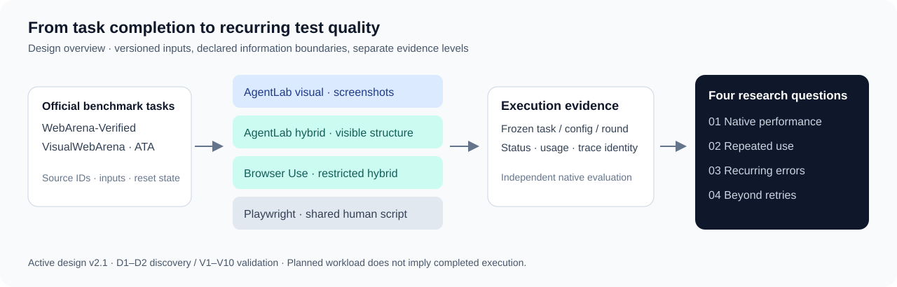
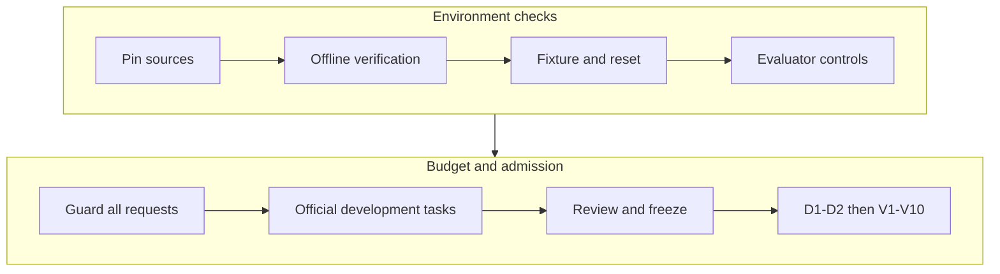

<div align="center">

# PSS-WebTest

### Beyond Task Completion

**Recurring errors, repeated reliability, and complementarity in computer-use agents and scripted Web testing.**

[](LICENSE)
[](code/config/active-study-design.json)
[](docs/STATUS.md)

[English](README.md) · [简体中文](README.zh-CN.md) · [Research design](docs/RESEARCH.md) · [Reproduce](docs/REPRODUCIBILITY.md) · [Status & roadmap](docs/STATUS.md) · [Cite](CITATION.cff)

</div>

**Running experiments with GPT API resources?** Start with the comprehensive [experiment operator README (中文)](README-EXPERIMENT-OPERATORS.zh-CN.md): target experiment matrix, API setup, CNY budget controls, staged acceptance, dispatch limitations, recovery and evidence handoff.

PSS-WebTest is an open-source research infrastructure project for comparing **screenshot-only CUAs, structure-assisted CUAs, and human-authored Playwright scripts** on public Web benchmarks. It connects native benchmark outcomes with repeated correctness, preparation effort, fresh verdicts on previously misjudged cases, and the additional coverage obtained by combining executors.

The practical question is: **when should a recurring Web test use another execution of the same agent, a different agent configuration, or a prepared script?**



> **Status — 22 September 2026.** The active design is `pss-manuscript-v2.1`. Its 322,164 scheduled opportunities are a **planned denominator**, not a completed-run count. Offline analysis, provenance, runtime and framework-component checks are available. Full benchmark-adapter acceptance and sponsor-host validation remain open; the current engineering reports set `confirmatory_authorized=false`. [Read the evidence status.](docs/STATUS.md)

## What you can use

- **A versioned comparison contract:** benchmark populations, configuration families, observation limits, discovery/validation rounds, and shared-script accounting.
- **An analysis implementation:** benchmark-native endpoints, fixed-workload correctness bounds, repeated-task outcomes, same-class error controls, and mixing-versus-retry comparisons.
- **Execution and audit infrastructure:** frozen schedule/input binding, separate actor/evaluator inputs, runtime receipts, request accounting, and local inspection tools.
- **Offline verification:** formula fixtures, boundary checks, recovery/accounting tests, and browser tests that do not call model APIs or execute official benchmark tasks.

The accompanying working manuscript is titled *Beyond Task Completion: An Empirical Study of Recurring Errors and Complementarity in Computer-Use Agents and Scripted Web Testing*. Its public paper link, persistent identifier and execution-level replication release are **Forthcoming**. This repository does not assert publication acceptance or reproduce private trajectories from aggregate tables.

## Four research questions

| Question | What is compared | Analysis to inspect |
| --- | --- | --- |
| **RQ1 · Native performance** | Task success, binary verdict correctness and failure-step agreement under the source benchmark's metrics | Template-macro WAV; task-level VWA; ATA confusion and step counts |
| **RQ2 · Repeated use** | Preparation coverage, correctness across twelve opportunities, and preparation effort | Fixed selected workload; always-correct/mixed/incorrect/unprepared/unresolved tasks |
| **RQ3 · Recurring errors** | Fresh alternative gains on discovery-error cases versus discovery-correct cases of the same reference class | Discovery-only cohorts; equal-case validation gain; excess gain; omitted-case bounds |
| **RQ4 · Beyond retries** | Mixed two-execution coverage versus retrying either configuration | Common four-outcome blocks; margin over the better retry; accuracy/disagreement decomposition |

See [the research guide](docs/RESEARCH.md) for the populations, formulas, weighting and analysis boundaries. Current reporting is descriptive; identification bounds are not confidence intervals.

## Benchmark and configuration matrix

| Benchmark | Source population | Selected design workload | Native outcome |
| --- | ---: | ---: | --- |
| WebArena-Verified (WAV) | 812 tasks | 600 tasks | Task success, averaged within templates and then across templates |
| VisualWebArena (VWA) | 910 tasks | 700 tasks | Task-specific answer, state or visual evaluation |
| ATA | 113 cases | All 113: **62 expected-pass / 51 expected-fail** | Verdict correctness and failure-step alignment |

Source counts and selected counts have different meanings. Selected identities and admission need their own provenance; a population count alone proves neither. The earlier 112-case, 56/56 ATA description is superseded. Historical ATA summaries remain provisional until reconciled to official case IDs and source executions.

| IDs | Configuration | Permitted observations |
| --- | --- | --- |
| `v1`–`v6` | AgentLab/BrowserGym · visual | Screenshots and declared interaction/budget state |
| `h1`–`h6` | AgentLab/BrowserGym · hybrid | Visual inputs plus the restricted visible target projection |
| `u1`–`u6` | Restricted Browser Use · hybrid | The same permitted hybrid information boundary |
| `s` | Shared human-authored Playwright baseline | Public DOM/accessibility properties and visible state; no runtime LLM |

Six model labels × three CUA configurations, plus one shared script, give **19 configurations**. The [contract](code/config/study-design-contract.v2.1.json) records the labels; exact provider/API identities and framework versions must be bound for each campaign. A label is not evidence of API access or a completed run. Browser Use has no visual-only cell in this design.

The schedule is **D1–D2 + V1–V10** on the same selected tasks: `(600 + 700 + 113) × 19 × 12 = 322,164` opportunities, including unprepared tasks. RQ1 includes all nineteen configurations; RQ2–RQ4 focus on same-model AgentLab visual/hybrid and the shared script.

## Start with offline verification

Prerequisites: Node.js 20+, Python 3, npm, and Playwright Chromium for the browser checks. Use a fresh checkout or an isolated environment. No API key, private manuscript, historical cloud data or benchmark download is required for this path.

```sh
git clone https://github.com/WANGLEVY9/PSS-WebTest.git
cd PSS-WebTest/code
npm ci
npx playwright install chromium
# On a fresh Linux host, use: npx playwright install --with-deps chromium

npm run study:validate
mkdir -p artifacts/local-runtime
npm run sponsor:verify:portable -- \
  --python python3 --output artifacts/local-runtime/offline-001
```

Use a **new output directory** for each verification. The report includes source hashes, test counts, failures and explicitly unexecuted artifact-dependent checks. Test fixtures are synthetic engineering evidence. A green report does not authorize collection or establish agent capability.

From the repository root, check the public documentation:

```sh
node scripts/check-docs.mjs
./scripts/check-public-boundary.sh
```

For targeted tests, analysis imports and environment setup, continue with [the reproducibility guide](docs/REPRODUCIBILITY.md) and [the code runbook](code/README.md). The legacy `test:contracts` command includes tests requiring downloaded historical artifacts; use the portable entry point above for a source-only checkout.

## Technical design and native workflow compatibility

The technical guide separates **upstream requirements, study restrictions,
implementation and acceptance evidence**. Native scoring does not imply that
our restricted actors reproduce upstream default agents or leaderboard results.

| Area | Maintained specification |
|---|---|
| Inputs, outputs, private references and receipts | [Input/output contracts](docs/technical/INPUT_OUTPUT.md) |
| Observation boundaries, preparation and repetitions | [Testing paradigms](docs/technical/TESTING_PARADIGMS.md) |
| Three benchmark workflows and remaining gates | [WAV](docs/technical/benchmarks/WAV.md) · [VWA](docs/technical/benchmarks/VWA.md) · [ATA](docs/technical/benchmarks/ATA.md) |
| Framework-specific integration | [AgentLab](docs/technical/frameworks/AGENTLAB.md) · [BrowserGym](docs/technical/frameworks/BROWSERGYM.md) · [Browser Use](docs/technical/frameworks/BROWSER_USE.md) · [Playwright](docs/technical/frameworks/PLAYWRIGHT.md) |
| Scheduling, reset, retries and cost | [Runtime](docs/technical/RUNTIME.md) · [Upstream traceability](docs/technical/UPSTREAM_TRACEABILITY.md) |
| Sponsor installation and evidence return | [Cloud handoff](code/local-lab/cloud-handoff/README.md) · [Dependency inventory](code/local-lab/cloud-handoff/dependency-manifest.json) |



At runtime baseline `de93d32`, WAV has a shopping-only owned lifecycle; VWA has
live-page deterministic evaluation but judge-dependent tasks remain blocked;
ATA has a reference comparator awaiting fixture/label parity. The separate
CNY 1,500 shared-budget implementation has **not** been integrated into all native
framework paths. These are release gates, not installation steps to skip.

## Inspect or extend the project

| Goal | Start here |
| --- | --- |
| Understand the scientific comparison | [Research design and metric map](docs/RESEARCH.md) |
| Reproduce code and formula checks | [Reproducibility guide](docs/REPRODUCIBILITY.md) |
| Understand what is implemented or still open | [Evidence status and roadmap](docs/STATUS.md) |
| Deploy official benchmark fixtures | [Deployment and acceptance](code/local-lab/SPONSOR-DEPLOYMENT.md) |
| Inspect the active contract or analysis code | [Design pointer](code/config/active-study-design.json) · [analysis implementation](code/local-lab/study-analysis.mjs) |
| Use the local console | [Observatory guide](code/local-lab/README.md) |
| Report a reproducibility problem | [Issue templates](https://github.com/WANGLEVY9/PSS-WebTest/issues/new/choose) |

```text
code/config/active-study-design.json    Current design authority
code/local-lab/                         Benchmark integration, runtime and analysis
code/src/                              Earlier harness and shared contracts
code/tests/contracts/                  Contract and provenance regression tests
docs/                                  Public research and reproduction guides
results/local-runtime/                 Dated engineering evidence summaries
results/phase2/                        Historical feasibility and pilot reports
research/                              Design history and protocol notes
scripts/                               Documentation and public-boundary checks
```

Older local-application pilots remain useful engineering history. They are outside the current three-benchmark core workload. The manuscript, submission packages, internal mock discussion data, credentials and raw authenticated traces are not public release material. See [data and artifact availability](docs/DATA_AVAILABILITY.md).

## Contribute and cite

Contributions are welcome in benchmark acceptance, restricted framework adapters, evaluator controls, reproducible analysis and documentation. Start with [CONTRIBUTING.md](CONTRIBUTING.md), [the roadmap](docs/STATUS.md#roadmap), and [the code of conduct](CODE_OF_CONDUCT.md). Report sensitive issues through [SECURITY.md](SECURITY.md).

Use [CITATION.cff](CITATION.cff) to cite this software, and record the exact commit used. No release version or DOI is asserted by the citation file. The MIT license covers this repository's own code and documentation; benchmark data, applications and upstream frameworks retain their respective terms. See [third-party acknowledgments](docs/THIRD_PARTY.md).

Maintained by [Taijie Wang](https://github.com/WANGLEVY9).
