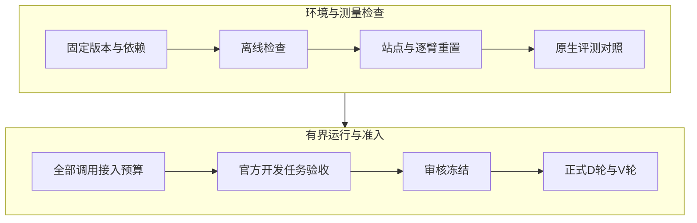

# PSS-WebTest

**实验人员入口：**请先阅读[GPT API 接入与实验执行操作手册](README-EXPERIMENT-OPERATORS.zh-CN.md)，涵盖该跑哪些配置、预算预警、分阶段验收、D/V轮次、执行命令、故障恢复和材料交回。

**超越任务完成率：研究 Computer-Use Agent 与脚本式 Web 测试的重复可靠性、反复错误和互补性。**

[English](README.md) · [研究设计](docs/RESEARCH.md) · [复现指南](docs/REPRODUCIBILITY.md) · [状态与路线图](docs/STATUS.md) · [引用信息](CITATION.cff)

PSS-WebTest 比较截图型 CUA、结构辅助 CUA 与人工编写的 Playwright 脚本。我们关心：同一批 Web 测试长期重复执行时，何时值得重试当前配置，何时应更换配置，何时混合执行能够带来额外覆盖。


> **2026-09-22 状态：**当前权威设计为 `pss-manuscript-v2.1`。322,164 是包含未准备任务在内的**计划执行机会数**，不是已完成运行量。离线公式、运行器和框架组件检查已提供；完整 benchmark 适配器、实际部署主机与正式采集准入仍需验证。已有工程报告为 `confirmatory_authorized=false`。

## 研究问题

| RQ | 问题 |
| --- | --- |
| RQ1 原生性能 | 不同执行方式在 benchmark 原生任务成功、判定正确性与失败步骤匹配方面有何差异？ |
| RQ2 重复使用 | 把准备失败、重复正确性和准备劳动纳入后，原生性能优势是否仍成立？ |
| RQ3 反复错误 | 替代配置在过去判断错误的案例上是否改善，其收益是否超过同参考类别的发现阶段正确案例？ |
| RQ4 超越重试 | 混合两种配置是否超过分别重试任一种配置？准确性差异与结果分歧如何解释覆盖收益？ |

当前分析为描述性分析；缺失识别界与置信区间分别处理，不从四舍五入的汇总表反推统计显著性。

## 当前设计

- WAV：源数据 812 项，设计选定 600 项；任务成功按模板宏平均。
- VWA：源数据 910 项，设计选定 700 项；保留其原生任务评估。
- ATA：全部 113 项，62 expected-pass、51 expected-fail；保留原始类别。旧的 112 项、56/56 论文描述已废止；历史汇总仍待按原始记录重新核对。
- 配置：6 个模型标签 × AgentLab visual / AgentLab hybrid / 受限 Browser Use hybrid，加 1 个共享人工 Playwright 基线，共 19 个配置。模型展示名不等于已验证 API 身份。
- 重复：D1–D2 用于发现，V1–V10 用于验证；同一任务不同执行，不是训练/测试任务随机切分。

完整定义以 [active-study-design.json](code/config/active-study-design.json) 指向的合同为准。官方 task ID、实际运行、人工准备和独立评估都有各自的证据要求，不能靠修改计数补齐。

## 先复现离线检查

需 Node.js 20+、Python 3、npm 和用于浏览器测试的 Chromium。此路径不需要模型密钥、旧云端运行、私有论文或 benchmark 下载。

```sh
git clone https://github.com/WANGLEVY9/PSS-WebTest.git
cd PSS-WebTest/code
npm ci
npx playwright install chromium
npm run study:validate
mkdir -p artifacts/local-runtime
npm run sponsor:verify:portable -- \
  --python python3 --output artifacts/local-runtime/offline-001
```

输出目录必须是新的。报告记录源码哈希、实际执行的测试和未运行的历史资产检查；离线测试中的合成样例不计入实验结果。Linux 新环境的 Chromium 系统依赖安装方式见[英文复现指南](docs/REPRODUCIBILITY.md)。

## 技术文档与云端交接

文档按“原生要求 → 本研究限制 → 当前实现 → 验收证据”编排。使用原生评分不代表复现上游默认agent或排行榜分数。

| 内容 | 专项说明 |
|---|---|
| 输入、输出、隐藏参考、收据 | [输入输出契约](docs/technical/INPUT_OUTPUT.md) |
| 视觉/混合/人工脚本、准备与重复测试 | [测试范式](docs/technical/TESTING_PARADIGMS.md) |
| 三个benchmark的原生流程 | [WAV](docs/technical/benchmarks/WAV.md) · [VWA](docs/technical/benchmarks/VWA.md) · [ATA](docs/technical/benchmarks/ATA.md) |
| 各框架的真实调用和限制 | [AgentLab](docs/technical/frameworks/AGENTLAB.md) · [BrowserGym](docs/technical/frameworks/BROWSERGYM.md) · [Browser Use](docs/technical/frameworks/BROWSER_USE.md) · [Playwright](docs/technical/frameworks/PLAYWRIGHT.md) |
| 幂等、恢复、重试、成本与上游依据 | [运行设计](docs/technical/RUNTIME.md) · [对照矩阵](docs/technical/UPSTREAM_TRACEABILITY.md) |
| 云主机安装、容量、依赖与验收交回 | [中文交接手册](code/local-lab/cloud-handoff/README.md) · [机器可读清单](code/local-lab/cloud-handoff/dependency-manifest.json) |



当前文档对应运行基线 `de93d32`：WAV owned lifecycle仅覆盖shopping；VWA依赖模型的评测仍受阻；ATA参考比较器仍待fixture与标签一致性验收。1500元共享预算实现位于独立工程分支，尚未覆盖此主线的全部原生框架调用。云端安装成功和离线测试通过均不能替代这些验收项。

## 项目入口

| 内容 | 位置 |
| --- | --- |
| 研究设计、信息边界与指标 | [Research guide](docs/RESEARCH.md) |
| 离线验证、数据导入、部署路径 | [Reproducibility guide](docs/REPRODUCIBILITY.md) |
| 最新证据与待完成事项 | [Status & roadmap](docs/STATUS.md) |
| 运行代码与命令 | [code/README.md](code/README.md) |
| 本地控制台 | [Observatory guide](code/local-lab/README.md) |
| 数据公开范围与 mock 隔离 | [Data availability](docs/DATA_AVAILABILITY.md) |
| 社区参与 | [Contributing](CONTRIBUTING.md) · [Issues](https://github.com/WANGLEVY9/PSS-WebTest/issues/new/choose) |

工作论文标题为 *Beyond Task Completion: An Empirical Study of Recurring Errors and Complementarity in Computer-Use Agents and Scripted Web Testing*。公开论文链接、持久标识符和逐执行复现数据包均为 **Forthcoming**，不宣称论文已录用。实验室内部 mock、旧汇总与工程验证均不能替代实测证据。

软件引用见 [CITATION.cff](CITATION.cff)，请同时记录使用的 commit。项目自身代码与文档使用 [MIT License](LICENSE)，第三方 benchmark、框架和应用遵循各自条款。
