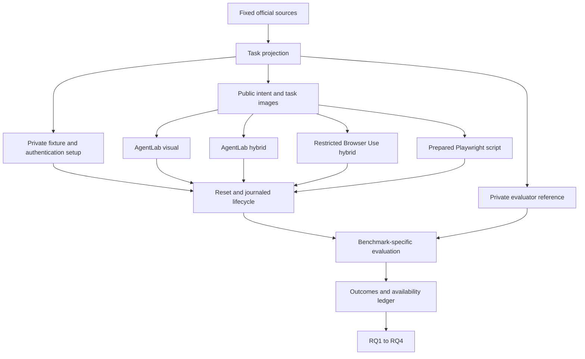

# Technical documentation

For experiment operators, the [comprehensive Chinese README](../../README-EXPERIMENT-OPERATORS.zh-CN.md) connects these specifications into an ordered GPT API acceptance and execution workflow.

[Project](../../README.md) · [Research design](../RESEARCH.md)

Documentation baseline: `8796b8b` plus the integration of the committed acceptance
branch through `95c537d`, reviewed 22 September 2026. Uncommitted experiments are not part
of that implementation. This documentation describes a restricted comparative
study, not a reproduction of every upstream default agent or leaderboard score.

## Reading map

| Responsibility | Specification |
|---|---|
| Experiment inputs, private setup and outputs | [Input/output contracts](INPUT_OUTPUT.md) |
| Visual, hybrid, scripted and repeated testing | [Testing paradigms](TESTING_PARADIGMS.md) |
| Official task, environment and evaluator semantics | [WAV](benchmarks/WAV.md) · [VWA](benchmarks/VWA.md) · [ATA](benchmarks/ATA.md) |
| Framework integration and deliberate restrictions | [AgentLab](frameworks/AGENTLAB.md) · [BrowserGym](frameworks/BROWSERGYM.md) · [Browser Use](frameworks/BROWSER_USE.md) · [Playwright](frameworks/PLAYWRIGHT.md) |
| Scheduling, resets, costs and recovery | [Runtime and acceptance](RUNTIME.md) |
| Native source → requirement → implementation → check | [Upstream traceability](UPSTREAM_TRACEABILITY.md) |
| Cloud provisioning and operator handoff | [Cloud deployment](../../code/experiment/cloud-handoff/README.md) |

The private setup and gold paths never become actor observations. Capturing DOM,
URLs or network traces for evaluation does not authorize feeding them to visual
agents. A task can fail while its measurement is valid; a successful final page
can coexist with a timeout or invalid measurement.

## Authority and document maintenance

1. [Active study pointer](../../code/config/active-study-design.json) selects the
   scientific design; dated reports and old manifests cannot override it.
2. Fixed upstream source defines native task/evaluator semantics. Our adaptation
   and remaining deviations are recorded separately on each component page.
3. Runtime source, bound configuration and source-hashed receipts establish what
   was actually executed. Documentation and readiness booleans cannot supply
   missing evidence.
4. Historical reports remain dated records. Current navigation points here;
   corrections do not rewrite their original outcomes or test counts.

For an implementation change, update the relevant component page, traceability
row, interface contract and status entry. Include a genuine acceptance receipt
before replacing “component-tested” with “live accepted.” Run `node
scripts/check-docs.mjs` from the repository root to check maintained documentation.
