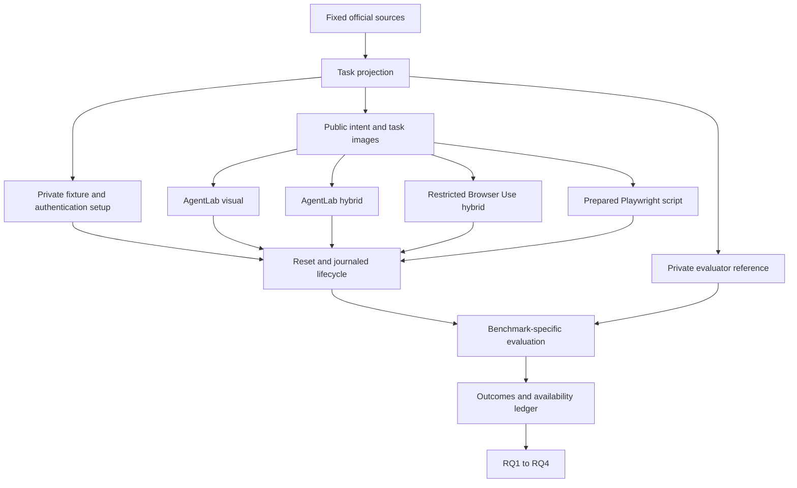

# Technical documentation

For the benchmark-by-method matrix and execution sequence, see the [experiment map](../EXPERIMENTS.md) or its [Chinese version](../EXPERIMENTS.zh-CN.md).

[Project](../../README.md) · [Experiment map](../EXPERIMENTS.md) · [实验地图](../EXPERIMENTS.zh-CN.md) · [研究设计](../RESEARCH.md)

This documentation specifies the benchmark inputs, execution methods, runtime
interfaces, evaluation boundaries and analysis workflow for the comparative
study. The experiment map is the quick reference for running each benchmark and
method combination.

## Reading map

| Responsibility | Specification |
|---|---|
| Experiment inputs, private setup and outputs | [Input/output contracts](INPUT_OUTPUT.md) |
| Visual, hybrid, scripted and repeated testing | [Testing paradigms](TESTING_PARADIGMS.md) |
| Official task, environment and evaluator semantics | [WAV](benchmarks/WAV.md) · [VWA](benchmarks/VWA.md) · [ATA](benchmarks/ATA.md) |
| Framework integration and deliberate restrictions | [AgentLab](frameworks/AGENTLAB.md) · [BrowserGym](frameworks/BROWSERGYM.md) · [Browser Use](frameworks/BROWSER_USE.md) · [Playwright](frameworks/PLAYWRIGHT.md) |
| Scheduling, resets, costs and recovery | [Runtime and acceptance](RUNTIME.md) |
| Native source → requirement → implementation → check | [Upstream traceability](UPSTREAM_TRACEABILITY.md) |
| Cloud provisioning and operator handoff | [Cloud deployment](../../code/experiment/cloud-handoff/README.md) |

The private setup and gold paths never become actor observations. Capturing DOM,
URLs or network traces for evaluation does not authorize feeding them to visual
agents. A task can fail while its measurement is valid; a successful final page
can coexist with a timeout or invalid measurement.

## Study specification and implementation

1. [Study contract](../../code/config/active-study-design.json) defines the
   scientific design, task samples, execution cells and repeated rounds.
2. Pinned benchmark sources define native task and evaluator semantics. Each
   component page documents the corresponding inputs and adaptations.
3. Bound configuration and source-identified execution records specify the
   runtime settings and evidence used in an analysis.
4. Update the relevant component page, upstream traceability entry and interface
   contract when changing an implementation. Run `node scripts/check-docs.mjs`
   from the repository root to check documentation links and required content.
