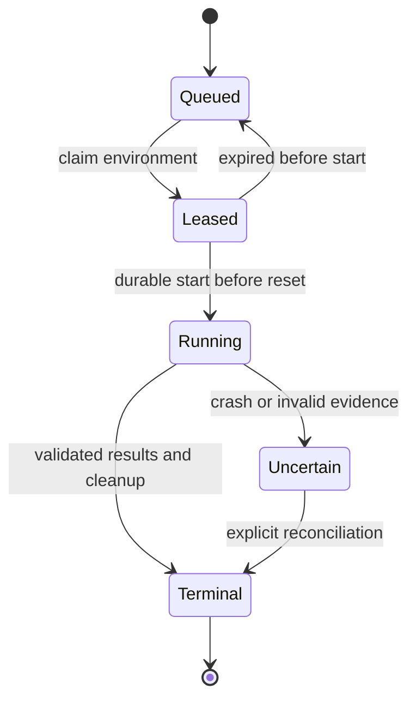

# Runtime, cost and acceptance design

[Technical index](README.md) · [Lifecycle details](../../code/local-lab/LIFECYCLE-AND-NATIVE-EVALUATION.md)

## Scheduling and recovery

[runtime_store.py](../../code/local-lab/runtime_store.py) uses a single-host
SQLite WAL ledger, unique scientific cells, worker leases and environment locks.
An execution is marked started before reset or another external side effect.
An expired unstarted lease can return to the queue; an expired started execution
is uncertain and retains its environment quarantine until reconciliation.
This is not a distributed/NFS scheduler or a promise of exactly-once external
HTTP/SUT effects.

The [worker](../../code/local-lab/runtime_worker.py),
[session](../../code/local-lab/benchmark_task_session.py) and
[actor wrapper](../../code/local-lab/benchmark_actor_lifecycle.py) separate public
input, trusted reset/setup and private evaluation. Diagnostic/synthetic scope
does not authorize formal execution. Source/configuration hashes are necessary
integrity checks; they do not prove true fixture restoration.

## Clock and evaluator lifecycle

| Phase | Budget treatment |
|---|---|
| Reset and authenticated session setup | Separate measured bounds |
| Executor initialization, observation, request, action, final visible observation | Actor monotonic budget |
| VWA evaluation | After actor-end, before close; separate bound |
| Trace/HAR sealing and context close | Finalization bound |
| WAV/ATA assessment, cleanup | Independent bounded operations |
| Process import/transport/receipt overhead | Explicit allowance, not silently omitted |

The driver declares a bounded observation timeout (5 seconds by default; the
new task-260 probe declares 30 seconds), always clipped by remaining actor time.
Changing that setting or coordinate space creates a new declared configuration;
it does not retroactively repair failed captures or clicks.

Do not subtract monotonic clocks across hosts. Timeout/operational failure stays
a failure even if an independent native score is 1. Conversely, lifecycle
completion with native score 0 is not an infrastructure failure by definition.

## Cost controls: implementation scope matters

| Implementation | Present at this documentation baseline | Limit |
|---|---|---|
| Mainline framework transport | [framework_model.py](../../code/local-lab/framework_model.py) reserves each actual attempt in the campaign SQLite ledger; no SDK retry/fallback | A per-database bound is not a shared allowance across all campaigns |
| Mainline live Qwen controls | Explicit live invocation, bounded synthetic-site diagnostics and a separate official task-260 probe | Keep synthetic and official evidence separate; neither certifies all selected tasks or verified actual billing |
| Separate acceptance branch `0b7301a` | CNY1500 shared guard, 80/90/95% thresholds, task caps, console alerts | Not integrated with this mainline native transport; do not assume its fields/UI exist here |
| Provider account settings | External project/organization enforcement | Not set by local configuration files or inferred from an API key |

The [cloud handoff](../../code/local-lab/cloud-handoff/README.md) carries the
budget branch's deployment requirements as **pending integration**. A complete
release must wire every actor, evaluator model and auxiliary request to the same
budget authority before claiming global enforcement. Never reset allowance by
creating a new DB. Unknown cost retains reservation; measured usage and billing
coverage must remain explicit. Multi-host dispatch requires a common authority.

Prospective CNY defaults are 1500 total, warnings at 1200/1350, stop new tasks at
1425, per-execution 15 and 30 requests/240 seconds. These are development defaults,
not historical study settings or evidence that the planned study fits the budget.
Price/FX provenance, output caps and billable input bounds must be validated.
No silent actor downgrade is allowed. Post-run metadata annotation, if used,
cannot change actions, labels or official verdicts.

## Release acceptance

Follow [ACCEPTANCE-RUNBOOK.md](../../code/local-lab/ACCEPTANCE-RUNBOOK.md): a fixed
development cohort, nested 2→10→20 official tasks per benchmark, four profiles,
and prespecified stability repeats. Keep all engineering failures and legitimate
method failures; do not replace tasks based on outcomes or require a capability
success threshold to declare measurement valid.

Before official paid canaries: source/asset closure, platform-compatible locks,
reset and unchanged peer state, required observations/actions, native evaluator
controls, request accounting and bound inputs must be verified. Then reconcile
provider charges and replay evidence. Formal collection requires a separately
reviewed frozen campaign; it is not enabled by a green unit test, import or
configuration boolean.

Failed reports remain immutable evidence. A rerun receives a new evidence root;
ambiguous external effects are reconciled first. Back up SQLite consistently,
including WAL semantics, and release only reviewed redacted summaries.
