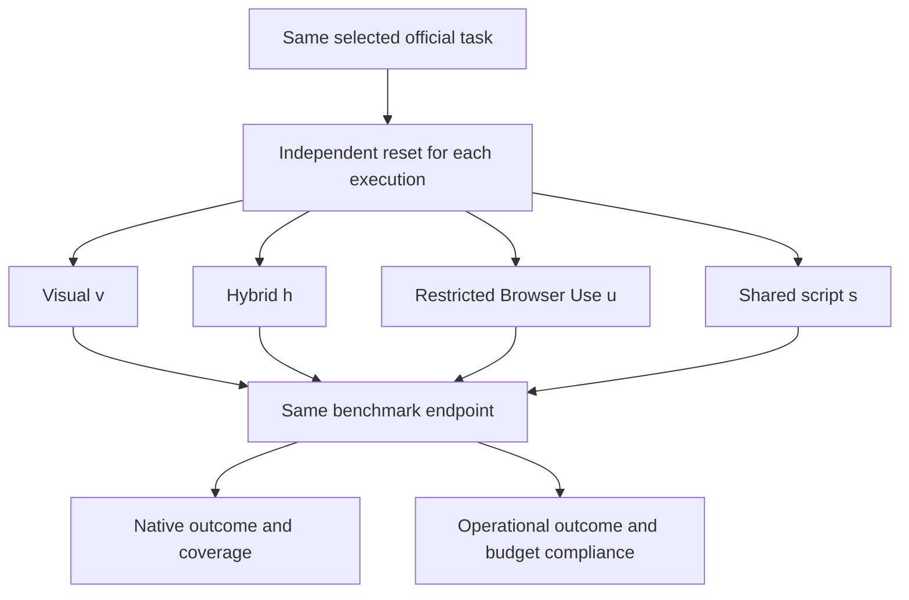
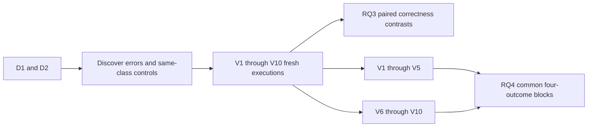

# Testing paradigms and comparison rules

[Technical index](README.md) · [Research estimands](../RESEARCH.md)

The active study crosses six model identities with three agent configurations,
then adds one shared script: 19 configurations. It is a **partial** framework /
observation crossing; Browser Use has no visual-only cell.

| Paradigm | IDs | Decision input | Actuation | Preparation and outcome |
|---|---|---|---|---|
| Screenshot-only | v1–v6 | Pixels, public task/images, own permitted interaction state | AgentLab decision → restricted coordinate actuator | Frozen framework/model policy; native evaluator |
| Structure-assisted | h1–h6 | Visual input plus visible control projection | Same AgentLab family and declared action boundary | Same-model contrast with visual |
| Framework comparison | u1–u6 | Restricted hybrid projection | Browser Use decision/tool schema → project actuator | RQ1 framework sensitivity, not stock Browser Use reproduction |
| Prepared script | s | Public UI/DOM/AX during blinded authoring and execution | Reviewed frozen Playwright script | Shared across models; preparation failures remain in denominator |

“Same endpoint” does not mean identical observation access. The differing input
boundary is part of the comparison; hidden evaluator information is never part
of any method. A common native score cannot make an invalid observation fair.

## Preparation and matched execution

Select official IDs without observed arm outcomes; retain blocked/unprepared
tasks. Freeze task order, framework/library versions, model/API identity,
prompt/image/action settings, environment baseline and prospective budgets.
The script author must not use evaluator implementation, gold, other-arm traces
or outcomes. AI-assisted development scripts cannot establish the human-authored
baseline. Record preparation attempts and labor, including unsuccessful work.

Reset each task × configuration × round, not just each batch. Do not resume an
alternative method from the previous method's modified browser/SUT state.
Parallel workers need isolated complete fixture closures; a fresh browser context
does not isolate a shared database. Shared script rows are reused analytically,
not executed/copied six times to manufacture independent evidence.

## Repetition, discovery and mixing

D/V rounds are study design, not an upstream default. RQ3 uses comparator minus
visual correctness, then subtracts same-reference-class control gain. RQ4 chooses
first available results in the two windows after the joint-availability gate;
it compares a mixed two-attempt strategy with both same-method retry controls.
It is offline outcome analysis, not a deployed model router, oracle selector or
four-attempt union. Equal attempts need not have equal dollar cost.

## Testing layers and what they establish

| Layer | Typical evidence | Does not establish |
|---|---|---|
| Synthetic contracts/formulas | Unit fixtures and invariants | Real task performance |
| Real framework, injected response | Native parser/schema and action execution | Model capability or full benchmark conformance |
| Live provider, synthetic website | Actual request, coordinates, timing and failure trace | Official benchmark success |
| Native evaluator controls | Known positive/negative execution evidence | Every selected task's environment closure |
| Official development canary | Bound task, reset, framework, evaluator and replay | Full planned study completion |
| Frozen measured campaign | Admitted configurations and retained scheduled denominator | Unseen configurations or historical cloud reconciliation |

Transport retry, framework parser retry, task replay and experimental repetition
are separate operations. Never relabel retries as new independent tasks. Record
all provider attempts; quarantine ambiguous delivery/started crashes instead of
blind replay. Actor downgrading changes the configuration and requires a separate
prospective routing experiment. Deterministic checks should not use an LLM;
VWA's genuinely native judge-dependent tasks require their own audited judge
policy rather than silently replacing it with a cheap model.
