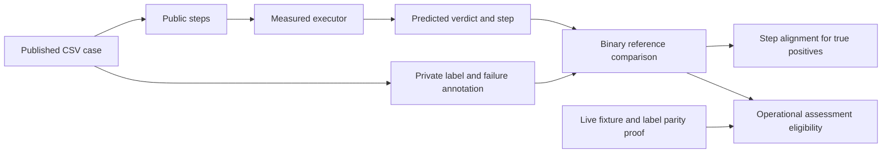

# ATA / piñata technical design

[Technical index](../README.md) · [Input/output contract](../INPUT_OUTPUT.md)

## Native authority and corrected population

Sources: [piñata README](https://github.com/Smartesting/pinata/blob/650b9edaa055915cb27d2498f379a66430cc3e02/README.md)
and [evaluation.py](https://github.com/Smartesting/pinata/blob/650b9edaa055915cb27d2498f379a66430cc3e02/evaluation.py)
at `650b9edaa055915cb27d2498f379a66430cc3e02`, plus the
[published artifact](https://zenodo.org/records/15198569).
The upstream workflow orchestrates an actor and assertor and obtains its verdict
and step from that execution; its reset dispatches workflows against the authors'
infrastructure. It is not a standalone, model-independent oracle that PSS can
invoke against any local fixture.

The corrected published source population is **113 cases: 62 PASS / 51 FAIL**.
The [population manifest](../../../code/config/ata-source-population.v1.json)
records six CSV hashes and application counts: Classifieds 30, OneStopShop 49,
Postmill 34. Preserve official cases, including parsing edge cases and source
step labels; line/delimiter counts are not a reliable task count. Historical
112-case or 56/56 summaries need source-level reconciliation, not a changed divisor.

## Actor, fixture and reference separation

[prepare_official_runtime.py](../../../code/experiment/prepare_official_runtime.py)
creates public intent/steps and a separate private reference file. Public
`expectedResult` states what the test checks; reference PASS/FAIL and failure
annotations stay hidden. Original source bytes, ZIP/CSV hashes, application and
official task identity are bound through the schedule.

The [original paper, Sections 4.2–4.3](https://arxiv.org/html/2504.01495v1)
uses original WebArena/VWA applications and fresh deployments. Its failing cases
change test instructions to request unimplemented features; they do not require
51 separately mutated application builds. Matching application names still does
not establish seed data, account or reset parity. Sponsor-owned fixtures must
demonstrate original-label/live-state parity. Do not trigger the upstream authors'
GitHub reset with ambient credentials or point trials at unrelated public sites.

## Prediction and assessment

All arms use the same public completion schema:

```json
{"verdict":"FAIL","failure_step":2}
```

PASS/FAIL/null are allowed verdicts. Only FAIL may carry a positive official
source step label. Abstention is null, not an implicit FAIL. Invalid schemas,
extra keys and gold-based response repair are rejected.



[ata_native_evaluate.py](../../../code/experiment/ata_native_evaluate.py) is explicitly
`pss-ata-reference-evaluator-v1`. It computes reference agreement; it must not be
advertised as an independently executed native runtime oracle. Until live parity
is established, reference correctness does not justify operational correctness.

Failure is the positive class: false pass = FN; false alarm = FP. Report verdict
coverage among started executions, accuracy, sensitivity and specificity with
their actual denominators. A true positive can locate failure before (`AFB`), at
(`AFC`) or after (`AFA`) the source step; ambiguous alignment remains `Ustep`.
Binary correctness can be available while step accuracy is null. Preserve this
distinction in strict-step measures and upper bounds.

## Acceptance and research use

Required controls: source-case mapping, baseline restoration, expected passing
and failing cases, known before/exact/after step predictions, ambiguous labels,
abstention, invalid output, timeout, crashed reset and unchanged peer state. Label
parity must be independent of whether the measured agent agrees with the label.

RQ3 selects discovery errors and same-reference-class controls using D1–D2,
then evaluates fresh V1–V10 paired outcomes. RQ4 uses the same retained blocks
for mixing and retry. These are PSS analyses, not upstream piñata default reporting.
The [research guide](../../RESEARCH.md) defines the current estimands and bounds.

The dated local feasibility record (kept in the ignored `temp/` archive)
records original-image access and capacity constraints. An inaccessible hosted
reset repository does not prove local provisioning impossible. An optimized WAV
Shopping image is a port candidate, not automatically the original ATA fixture.
