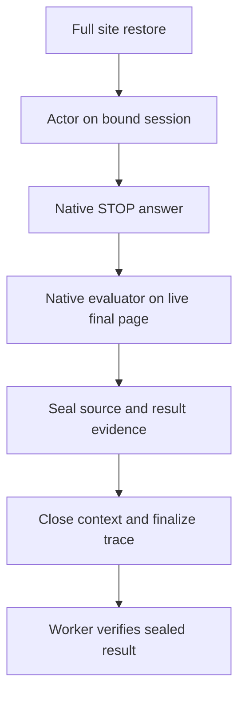

# VisualWebArena technical design

[Technical index](../README.md) · [Fixture runbook](../../../code/local-lab/VWA-FIXTURE-DEPLOYMENT.md)

## Native authority

Source: web-arena-x/visualwebarena, commit
`89f5af29305c3d1e9f97ce4421462060a70c9a03`.
The fixed [installation and evaluation instructions](https://github.com/web-arena-x/visualwebarena/blob/89f5af29305c3d1e9f97ce4421462060a70c9a03/README.md)
cover Python 3.10/3.11, site URLs, generated configs and authentication.
The native inventory has 910 tasks; PSS plans 700 selected tasks. Site-scoped IDs,
public image attachments, initial page ordering and native evaluator semantics
must survive adaptation. Missing image/captioning dependencies are blockers,
not a reason to convert a task into text-only testing.

## Services, assets and setup

The [fixed environment guide](https://github.com/web-arena-x/visualwebarena/blob/89f5af29305c3d1e9f97ce4421462060a70c9a03/environment_docker/README.md)
is the source for Classifieds, Shopping, Reddit, Wikipedia and Homepage fixtures.
PSS adds owned fixture names, private routing, immutable assets and per-execution
state evidence; these restrictions do not change the native intended task state.
The [cloud handoff](../../../code/local-lab/cloud-handoff/README.md) lists per-site
ports, SQL/images, model weights, capacity measurement and Linux-lock gaps.

Keep a pristine official source and a hashed deployment/configuration copy.
`DATASET=visualwebarena`, actual site URLs and private Classifieds reset token
must agree across native config, browser network, task images and authentication.
Fresh cookies or a successful reset HTTP response do not prove database restore.

[prepare_navigation_runtime.py](../../../code/local-lab/prepare_navigation_runtime.py)
retains public images and separates setup/evaluation. MIME comes from bytes.
For the known GIF-in-PNG-name cases, model-view PNG follows native PIL initial
frame behavior while uploads retain original bytes. Record both identities.

## Evaluation must happen before close

The original [evaluator router](https://github.com/web-arena-x/visualwebarena/blob/89f5af29305c3d1e9f97ce4421462060a70c9a03/evaluation_harness/evaluators.py)
uses task-specific answer, URL, page and visual checks. PSS
[vwa_native_evaluate.py](../../../code/local-lab/vwa_native_evaluate.py) invokes it
on the final live page after actor-end, seals the result, and later verifies the
seal. Reopening a fresh page after teardown is not equivalent evaluation.

Current judge policy is `deterministic-only-fail-closed`. Deterministic text,
URL, DOM and image-SSIM controls are implemented; fuzzy text and VQA paths remain
evaluation-blocked until a frozen, separately costed native judge/captioning
configuration passes controls. “All evaluation is deterministic and free” is
therefore false for the entire VWA population. Do not drop those tasks, score
them zero, or let actor self-reported success substitute for the missing judge.

## Restore and release gates

[vwa_reset_contract.py](../../../code/local-lab/vwa_reset_contract.py) verifies a
full-site, lease-bound measurement manifest and dependency closure. It validates
restore evidence; it does not implement every host's snapshot backend. Project
operators must deliver real database/files/upload restoration for the selected
sites, repeated state measurements and peer isolation. Upstream hardcoded reset
scripts require adaptation before use on a shared host.

Acceptance must cover authentication, asset retrieval, multi-page start/focus,
actual required uploads/navigation, positive/negative native controls, evaluator
exceptions and unresolved labels, resource ceilings, replay and crash recovery.
Iframe/shadow-root projection coverage has explicit fail-closed limitations;
passing basic pages is not proof of full selected-task coverage.

Report task-macro native success and coverage by round, separately from lifecycle
completion and fixed-denominator correctness bounds. The selected population,
restricted actors and prospective repetition policy differ from the native
paper's full default-agent experiment; do not claim reproduced headline scores.
