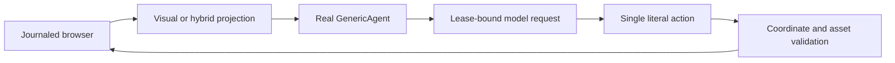

# AgentLab decision integration

[Technical index](../README.md) · [BrowserGym](BROWSERGYM.md)

## Upstream contract

Candidate distribution: **AgentLab 0.4.2**. The
[versioned README](https://github.com/ServiceNow/AgentLab/blob/v0.4.2/README.md)
describes BrowserGym-based studies, benchmark-specific setup, reproducibility
metadata and incomplete-job relaunch. Its task-dependency and instance-reset
policies matter for shared mutable sites. They do not automatically implement
PSS's independently reset task × configuration × round schedule.

The native [GenericAgent implementation](https://github.com/ServiceNow/AgentLab/blob/v0.4.2/src/agentlab/agents/generic_agent/generic_agent.py)
is the decision component. The package/tag identity, installed distributions,
browser version and deployment lock must be recorded; an upstream tag is not a
substitute for the installed package/source digest.

## PSS adaptation

| Concern | Current integration |
|---|---|
| Constructor | [framework_agentlab.py](../../../code/local-lab/framework_agentlab.py) creates the real GenericAgent |
| Observation | Screenshot always; hybrid gets only PSS visible projection serialized into the AX-text slot; raw AX/HTML stays empty |
| Additional state | No tabs/URLs/titles, focused element IDs, SoM, hints, plan, memory or hidden thinking history |
| Actions | Restricted BrowserGym action set; coordinates, keys, typing, scrolling, history/tab operations and pinned asset uploads |
| Parsing | Exactly one literal action; no arbitrary Python/JS, selectors or URL-navigation tool |
| Calls | `max_retry=1` means one parser attempt in this implementation; zero would issue none |
| Lifecycle | [native_framework_driver.py](../../../code/local-lab/native_framework_driver.py) owns the loop and journal; PSS owns reset/evaluation |

The wrapper deliberately does not call `GenericAgentArgs.set_benchmark` because
that can replace observation/action flags. Every observation passes the same
projection boundary, not just the initial prompt. The hybrid AX-text field is
an adapter transport slot, not permission to deliver the framework's default
accessibility tree.

## Version, timing and cost

The candidate [lock](../../../code/config/frameworks/h-agentlab.lock) includes
AgentLab 0.4.2, BrowserGym 0.14.2 and Playwright 1.44.0. The target Linux lock
must be separately reviewed; a developer import is not installation acceptance.
[framework_model.py](../../../code/local-lab/framework_model.py) uses a durable
request reservation and one real transport attempt. Requested/returned model
identity and actual usage remain evidence, not inferred from a display label.
Read [runtime accounting](../RUNTIME.md) for the separate shared-CNY budget branch.

Agent initialization, observation, model request and actions consume the actor
monotonic budget. Reset/setup, native evaluation and finalization have their own
bounded phases. Native score cannot repair a timed-out execution. Upstream
automatic incomplete-job relaunch must not bypass PSS's uncertain-state quarantine.

## Acceptance requirements

Verify visual receives no structure, hybrid contains only actually visible
controls, malicious/multi-action outputs are rejected, public task images reach
the model, coordinate conversion is calibrated, all attempts are accounted,
and action/trace identities agree. Injected response probes establish component
behavior only. Live synthetic controls establish provider connectivity only.
Official fixtures and native evaluators must pass the benchmark-specific gates.

This is an AgentLab-based restricted actor under a PSS-owned lifecycle. It does
not claim to reproduce stock GenericAgent settings, the upstream Study runner
or published leaderboard performance.
