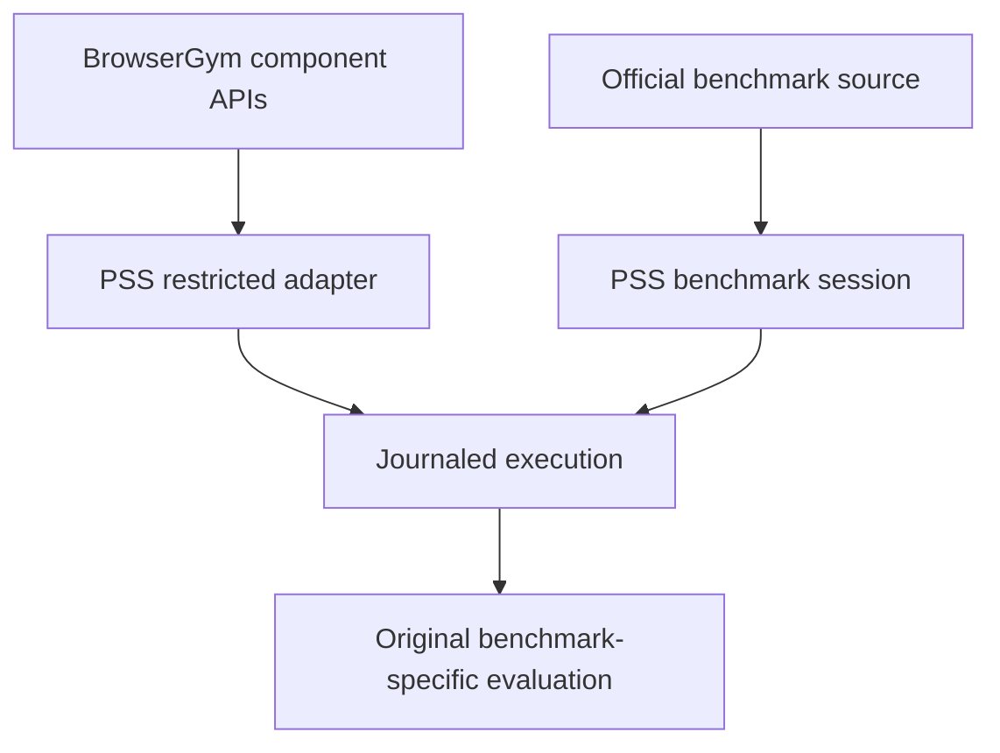

# BrowserGym environment and action boundary

[Technical index](../README.md) · [AgentLab integration](AGENTLAB.md)

## Upstream contract

Candidate distribution: **BrowserGym 0.14.2**. The
[versioned project documentation](https://github.com/ServiceNow/BrowserGym/tree/v0.14.2)
separates core functionality, experiment utilities and benchmark integrations.
Its Gym-style API returns observations and reward/termination signals through
reset/step/close; each benchmark has additional setup requirements. Installing
`browsergym` and Chromium alone does not provision those applications.

## What PSS uses and what it owns

| Layer | Responsibility in this implementation |
|---|---|
| BrowserGym | Native action-set/schema components used by AgentLab |
| PSS projection | Exact permitted visual/hybrid information, withholding raw observations |
| PSS actuator | Validated action execution and append-only replay journal |
| PSS lifecycle | Owned fixture reset, setup/authentication, budgets and cleanup |
| Benchmark source | Independent native task/evaluator definitions |

[framework_agentlab.py](../../../code/local-lab/framework_agentlab.py) obtains
`HighLevelActionSet` and restricts its action dictionary. Strict single-action
parsing and no force retry are declared. Custom asset/tab operations are
implemented in [framework_actions.py](../../../code/local-lab/framework_actions.py).
The outer browser execution is [journaled_browser.py](../../../code/local-lab/journaled_browser.py),
not evidence that an unmodified Gym task registration performed the run.

Raw rewards, termination hints, privileged task objects, URLs and replay-only
network data cannot select an actor's next action. A stock WebArena environment
with 812 tasks is not interchangeable with WebArena-Verified. VWA's native final
page evaluator also cannot be replaced by whatever reward another environment
happens to return. Match release, IDs, task configuration and endpoint semantics.

## Conformance checks

Record both aggregate BrowserGym and actual core/action package versions; inspect
the installed source rather than hardcoding a version string. Verify allowed
action names, strict decoding, public asset restrictions, viewport geometry and
no hidden-state observation fields. Fresh-context creation, benchmark reset and
per-arm isolation are separate checks.

The [framework probe](../../../code/local-lab/framework-native-probe.py) and
[actuator probe](../../../code/local-lab/journaled-browser-probe.py) are component
evidence, not native benchmark admission. See [input/output contracts](../INPUT_OUTPUT.md)
and [upstream traceability](../UPSTREAM_TRACEABILITY.md) before extending adapters.
