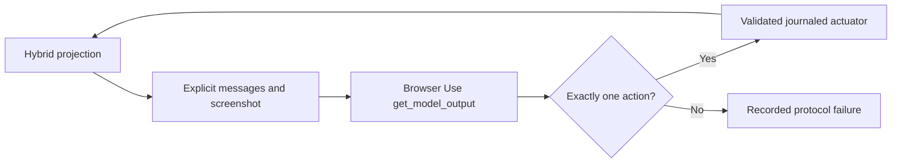

# Restricted Browser Use integration

[Technical index](../README.md) · [Testing paradigms](../TESTING_PARADIGMS.md)

## Native source and comparison scope

Candidate distribution: **browser-use 0.13.10**. Consult the
[versioned repository](https://github.com/browser-use/browser-use/tree/0.13.10)
and [Agent implementation](https://github.com/browser-use/browser-use/blob/0.13.10/browser_use/agent/service.py).
The upstream agent includes its own run loop, observations, tool execution and
recovery settings. PSS uses its model-output/tool-schema component while replacing
the outer lifecycle and observation policy. This is a declared experimental
restriction, not a reproduction of stock `Agent.run`.

Only hybrid cells `u1`–`u6` exist. A screenshot-capable library does not create a
visual-only cell in the research matrix.

## Adapter design

[framework_browser_use.py](../../../code/local-lab/framework_browser_use.py):

- Creates a real Agent and Tools registry, removes default actions and registers
  the explicit PSS coordinate/key/scroll/upload/tab/completion schemas.
- Overrides `run` to reject the default observation/control loop. The outer
  [native driver](../../../code/local-lab/native_framework_driver.py) invokes one
  `get_model_output` decision and sends the result to the journaled actuator.
- Sends original screenshot bytes, public task/images, restricted visible
  controls, generic action errors and previously accepted actions.
- Disables thinking, judge, planning, direct URL opening, message compaction,
  fallback model and hidden final-response-after-failure behavior.
- Rejects multi-action output instead of silently truncating it. Registry action
  stubs do not secretly execute browser operations.

`done(text)` is a completion proposal, not a correct answer or independent
success judgment. The benchmark-specific completion schema and evaluator remain
the same as for the other study arms.

## Installation and accounting

The current local [journaled-actuator candidate lock](../../../code/config/frameworks/h-browser-use-journaled-actuator.lock)
includes the actuator dependencies as well as macOS-only packages. The older
`h-browser-use.lock` omits greenlet, Playwright and pyee; it cannot describe this
expanded environment. Resolve and review a Linux lock with the frozen
framework version, plus the outer actuator's Playwright/browser dependencies.
Do not infer browser readiness from successful Browser Use import.

The actual model bridge is [framework_model.py](../../../code/local-lab/framework_model.py),
which owns reservations and transport attempts. Upstream cost estimation is
disabled in the adapter; absence of its cost field is not a zero-dollar result.
Record all failed attempts and unknown billing. The mainline campaign ledger
and the separate shared-CNY guard have different coverage; see [runtime](../RUNTIME.md).

## Required acceptance and limitations

Test registry exclusion, exact action count, original image delivery, lack of
DOM/URL/private-file leakage, accepted-action-only history, proper upload bytes,
tab ordinals, bounded requests, frame/action hashes and completion parsing.
Viewport projection currently fails closed on unsupported visible iframe/shadow
content; this limitation must stay visible in task coverage.

Installed-framework injected-response probes and live synthetic provider runs
are not official benchmark acceptance. A method failure on a valid native task
is an outcome; an unsupported projection or evaluator path is a separate
availability/engineering condition. Do not claim that these restrictions match
the upstream paper's default prompts, tools or headline results.
