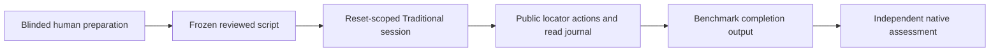

# Playwright scripted baseline and browser instrumentation

[Technical index](../README.md) · [Input/output contracts](../INPUT_OUTPUT.md)

## Native semantics and three roles

Playwright provides browser contexts, public locators, actionability/auto-waiting
and traces. Its [actionability documentation](https://playwright.dev/docs/actionability)
and [trace viewer documentation](https://playwright.dev/docs/trace-viewer) explain
those mechanisms; they do not define PSS task success or fair script authorship.
These are living upstream guides. Freeze the actual installed Playwright/browser
version in every campaign instead of treating current web documentation as a lock.

| Role | Input and authority |
|---|---|
| Browser substrate for agent arms | Only validated actions from the declared agent; no locator repair or DOM hints for visual |
| Traditional executor | A reviewed, frozen script using the allowed public UI/DOM/AX interface; no runtime LLM |
| Evidence capture | Screenshots, native trace, HAR and replay metadata, kept outside actor observation |

## Traditional integration

[traditional_actor.py](../../../code/local-lab/traditional_actor.py) exposes
reviewed public locator operations through a journaled Session wrapper. Writes,
reads, time and lease ownership are checked. Uploads resolve only pinned public
task assets. The script module and provenance are hash-bound by the lifecycle;
arbitrary code that accesses wrapper internals is not made safe by a Python API
wrapper alone. Script review and a trusted isolated process remain required.

The common [actor lifecycle](../../../code/local-lab/benchmark_actor_lifecycle.py)
uses reset-scoped session setup, actor timing and benchmark-specific finalization
for Traditional as well as the agent profiles. A script must return the same
WAV/VWA/ATA public completion contract; a Playwright assertion passing cannot
replace native evaluation.

## Fairness, retries and evidence

Preparation may inspect public UI but not gold, evaluator code or agent traces.
Record authoring, debugging and review labor, including failed adaptation. The
AI-assisted retrieval script in the older console remains diagnostic; its
existence does not satisfy the human-authored baseline. The shared `s` cell is
one configuration across model comparisons, not six independent scripts.

Auto-waiting consumes the declared deadline and is not a new experimental trial.
Do not turn test-runner retries, locator fallback or post-failure debugging into
unreported extra attempts. Actor timing starts before initialization/observations
and includes actions; setup/reset and finalization have separately bounded clocks.

WAV needs sealed HAR after close; VWA needs live-page evaluation before close.
Capture neither too early nor with missing response bodies. A trace that opens
in Trace Viewer helps inspection but does not prove native evaluator validity,
label parity, environment reset or source identity.

## Acceptance

Verify locator/read journal completeness, action budgets, lease fencing, pinned
asset uploads, output schema, full phase timing, replay chain, native positive/
negative controls, preparation provenance and no model calls. The same owned
environment/reset boundary must hold for all profiles. Missing human scripts
remain unprepared opportunities in the selected denominator, not silently
excluded “unsupported tasks.”
